# Rolling-Cutoff Forecast System Architecture

## System Architecture Diagram

```mermaid
graph TB
    User["👤 User (Jury/Artem)"]
    UI["🖥️ React UI<br/>ForecastPage.tsx"]
    API["🔌 FastAPI<br/>api_app.py"]
    Forecast["📊 Forecast Engine<br/>rolling_forecast.py"]
    Cache["💾 Cache<br/>Parquet files"]
    CSV["📁 CSV Data<br/>sites_service.csv<br/>sites_registry.csv"]
    Metrics["📈 Metrics Tracker<br/>metrics_history.parquet"]

    User -->|"Selects cutoff<br/>+ horizon"| UI
    UI -->|"GET /api/mytko/rolling_forecast"| API
    API --> Forecast
    Forecast -->|"Check cache"| Cache
    Forecast -->|"Load data"| CSV
    Forecast -->|"Save cache"| Cache
    API -->|"POST /api/mytko/ingest_metrics"| Metrics
    API -->|"GET /api/mytko/metrics_history"| Metrics
    API -->|"CSV/XLSX export"| UI
```



## Data Flow Diagram

### 1. Forecast Generation Flow
```
User Selection (Cutoff Date + Horizon)
    ↓
ForecastRequest Validation
    ↓
Check Parquet Cache
    ├─ Cache HIT → Return cached forecast
    └─ Cache MISS ↓
        Load Historical CSV Data (sites_service.csv, sites_registry.csv)
        ↓
        Baseline Estimation (historical average by site)
        ↓
        Rolling-Cutoff Simulation (day-by-day from cutoff forward)
        ↓
        Forecast Generation (1-365 days ahead)
        ↓
        Save to Parquet Cache
        ↓
        Return ForecastResult to API
        ↓
        UI Display & Export Options
```

### 2. Metrics Ingestion Flow
```
Validation Results (Fact vs Forecast)
    ↓
POST /api/mytko/ingest_metrics
    ↓
MetricsTracker Processing
    ↓
Store in metrics_history.parquet
    ↓
GET /api/mytko/metrics_history
    ↓
Dashboard Visualization
    ↓
Iteration Analysis (Algorithm improvement feedback)
```

### 3. Data Export Flow
```
ForecastResult in Memory
    ↓
Format Selection (CSV/XLSX/PDF/Bundle)
    ↓
Export Pipeline
    ├─ CSV: Direct tabular export
    ├─ XLSX: Spreadsheet with formatting
    ├─ PDF: Full report with charts
    └─ Bundle: ZIP with all artifacts
    ↓
Download to User
```

## File Structure

```
/src/sites/
├── rolling_types.py          # Type definitions (ForecastRequest, ForecastResult)
├── rolling_forecast.py       # Core forecast engine
├── rolling_cache.py          # Parquet caching layer
├── data_loader.py            # CSV data ingestion
├── metrics_tracker.py        # Iteration metrics history
└── data_access_layer.py      # Future ClickHouse abstraction

/scripts/
├── generate_bundles.py       # Pre-generate forecast bundles
├── export_forecast.py        # Forecast export functionality
├── validate_forecast.py      # Validation against actuals
└── cli_*.py                  # CLI utilities

/tests/
├── test_rolling_forecast.py  # Core algorithm tests
├── test_rolling_cache.py     # Cache layer tests
├── test_export.py            # Export functionality tests
└── test_metrics.py           # Metrics tracking tests

/docs/
├── architecture/
│   └── ARCHITECTURE.md       # This file
├── api/
│   └── endpoints.md          # API specification
├── data/
│   ├── schema.md             # CSV schema documentation
│   └── sample_data.csv       # Example data files

/frontend/
├── src/pages/
│   └── ForecastPage.tsx      # Main forecast UI
├── src/components/
│   ├── CutoffSelector.tsx    # Date picker component
│   ├── HorizonSelector.tsx   # Forecast horizon control
│   ├── ForecastChart.tsx     # Visualization
│   └── ExportPanel.tsx       # Export options
└── src/api/
    └── forecastClient.ts     # API client
```

## Key Components

### 1. Data Models (rolling_types.py)

**ForecastRequest**
- `cutoff_date`: Effective date for historical data (up to 2025-05-31)
- `horizon_days`: Forecast length (1-365 days)
- `site_ids`: Optional filter (all ~24k sites if not provided)

**ForecastResult**
- `request_params`: Echo of input request
- `baseline_stats`: Historical statistics used
- `forecast_data`: Daily forecasts with confidence intervals
- `metadata`: Generation timestamp, data version, cache status
- `validation_ready`: Boolean indicating if actuals are available

### 2. Forecast Engine (rolling_forecast.py)

```python
class RollingForecastEngine:
    - load_historical_data(cutoff_date)      # Load from CSV
    - estimate_baseline(cutoff_date)         # Calculate historical avg
    - simulate_rolling_window(cutoff, horizon) # Day-by-day simulation
    - generate_forecast(request)             # Main execution
```

**Algorithm:**
1. Filter data up to cutoff date (no future data leakage)
2. Calculate baseline: rolling average from historical window
3. Simulate forward: apply learned patterns day-by-day
4. Output: 1-365 day forecast with confidence bands

### 3. Cache Layer (rolling_cache.py)

- **Format**: Parquet (columnar, compressed, fast)
- **Key**: `{cutoff_date}_{horizon_days}_{site_filter_hash}`
- **TTL**: No expiration (forecasts are immutable at cutoff date)
- **Operations**: get(), set(), exists()

### 4. Metrics Tracker (metrics_tracker.py)

```python
class MetricsTracker:
    - ingest_validation_results(forecast_id, actuals)
    - calculate_metrics(forecast, actuals)  # MAPE, MAE, etc
    - store_history(metrics_record)        # Append to history.parquet
    - get_history(filters)                 # Query iteration data
```

**Metrics Stored:**
- Forecast ID, timestamp
- MAPE (Mean Absolute Percentage Error)
- MAE (Mean Absolute Error)
- RMSE (Root Mean Square Error)
- Coverage (confidence interval hit rate)
- By-site breakdown

### 5. Data Access Layer (data_access_layer.py)

**Current (CSV-based):**
- load_csv(path) → Pandas DataFrame
- filter_by_date_range(df, start, end)
- aggregate_by_site(df)

**Future (ClickHouse-ready):**
- Abstract QueryBuilder pattern
- Support for:
  - SELECT * FROM service_history WHERE date <= cutoff_date
  - Efficient aggregation queries
  - Partitioning by date, site_id

## Data Storage

### 1. CSV Data (Raw Historical)
- **Path**: `data/sites_service.csv`, `data/sites_registry.csv`
- **Size**: 5.6M rows of service history (2023-2025)
- **Schema**:
  - `date`: Service date (YYYY-MM-DD)
  - `site_id`: Unique site identifier
  - `value`: Actual service value
  - `sites_registry`: Site metadata (name, location, etc)
- **Access**: Immutable reference data

### 2. Parquet Cache
- **Path**: `cache/forecasts/`
- **Purpose**: Avoid recalculating identical forecasts
- **Naming**: `forecast_{cutoff_date}_{horizon_days}_{hash}.parquet`
- **Columns**: site_id, date, forecast_value, lower_ci, upper_ci
- **Compression**: Snappy (fast + efficient)

### 3. Metrics History
- **Path**: `cache/metrics_history.parquet`
- **Purpose**: Track algorithm iteration and validation
- **Append-only**: New metrics added each validation round
- **Query**: Join with forecast_id to trace lineage
- **Columns**: timestamp, forecast_id, site_id, metric_name, metric_value

### 4. Bundle Metadata
- **Path**: `bundles/{bundle_id}/metadata.json`
- **Contents**:
  - Forecast parameters (cutoff, horizon)
  - Data schema version
  - Algorithm version
  - Generation timestamp
- **Purpose**: Self-documenting bundles for sharing

## API Endpoints

### Forecast Generation
```
GET /api/mytko/rolling_forecast?cutoff_date=YYYY-MM-DD&horizon_days=30
Response: ForecastResult (JSON)
```

### Metrics Ingestion
```
POST /api/mytko/ingest_metrics
Body: {forecast_id, site_id_values: [actual, forecast]}
Response: {status, metrics_id}
```

### Metrics History
```
GET /api/mytko/metrics_history?cutoff_date=YYYY-MM-DD&metric=MAPE
Response: MetricsHistoryRecord[]
```

### Export Endpoints
```
GET /api/mytko/export/forecast/{id}.csv
GET /api/mytko/export/forecast/{id}.xlsx
GET /api/mytko/export/forecast/{id}.pdf
GET /api/mytko/export/bundle/{id}.zip
```

## UI Components Flow

```
ForecastPage (Main container)
├── CutoffSelector
│   ├── DatePicker (max 2025-05-31)
│   └── Validation
├── HorizonSelector
│   ├── RangeSlider (1-365 days)
│   └── Presets (7, 30, 90, 365)
├── ExecuteButton
│   └── Calls GET /api/mytko/rolling_forecast
├── ForecastChart
│   ├── Line chart (forecast, confidence bands)
│   ├── Scatter overlay (if actuals available)
│   └── Legend, zoom, pan
├── DataTable
│   ├── Daily forecasts
│   ├── Site-level aggregation
│   └── Sort/filter
└── ExportPanel
    ├── CSV, XLSX, PDF, Bundle buttons
    └── Download progress
```

## Technology Stack

| Layer | Technology | Purpose |
|-------|-----------|---------|
| **Frontend** | React 18 + TypeScript | Interactive UI |
| **Backend** | FastAPI | REST API server |
| **Data Processing** | Pandas + NumPy | Data manipulation |
| **Caching** | Parquet (PyArrow) | Efficient storage |
| **Database** | CSV (future: ClickHouse) | Historical data |
| **Testing** | pytest + pytest-cov | Test automation |
| **Deployment** | Docker | Container orchestration |

## Performance Characteristics

### Forecast Generation
- **Baseline**: ~2-5 seconds for 24k sites, 365 days
- **Cache Hit**: ~100ms (direct Parquet read)
- **Cache Miss**: ~3-5 seconds (full computation)

### Data Load
- CSV → Parquet: ~5 minutes (one-time)
- Parquet query: <100ms for any date range

### Metrics Storage
- Ingestion: ~50ms per record
- History query: <500ms for 1000+ records

## Future Enhancements (Post-MVP)

1. **ClickHouse Migration**
   - Replace CSV with distributed SQL
   - Real-time incremental updates
   - Complex aggregation support

2. **Advanced Caching**
   - Distributed cache (Redis)
   - Incremental forecast updates
   - Partial cache invalidation

3. **ML Model Integration**
   - Time-series models (ARIMA, Prophet)
   - Site-level custom models
   - Ensemble forecasting

4. **Monitoring & Alerts**
   - Forecast quality dashboard
   - Anomaly detection
   - Automated retraining triggers

---

**Last Updated**: 2025-12-28
**Version**: 1.0
**Status**: Active Development
