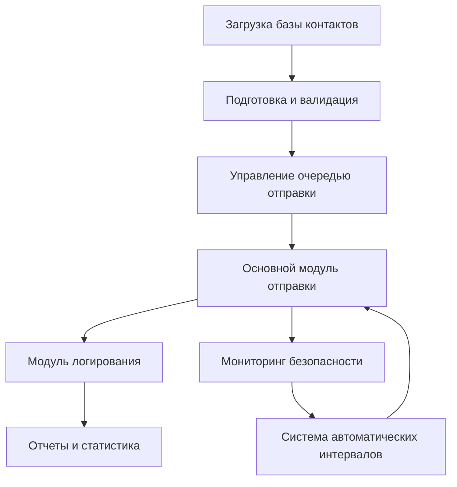
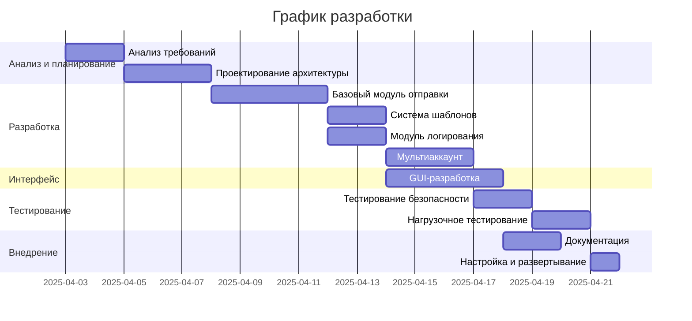

# iMessage Рассылка: Расширенный План Внедрения и Гарантии

## Уважаемый клиент,

Я внимательно изучил Ваше техническое задание на разработку скрипта для рассылки через iMessage и хочу представить улучшенное предложение, которое не только соответствует всем требованиям, но и предлагает дополнительные преимущества для вашего бизнеса.

## 🚀 Предлагаемое решение

### Архитектура системы

### Основные компоненты

1. **Высокопроизводительное ядро отправки**
   - Разработка на Python с интеграцией AppleScript для прямого доступа к iMessage API
   - Поддержка многопоточной отправки с интеллектуальным распределением нагрузки
   - Система очередей для оптимизации пропускной способности

2. **Многоформатная обработка контактов**
   - Поддержка всех требуемых форматов: Excel, CSV, TXT
   - Автоматическая валидация номеров и форматирование для совместимости с iMessage
   - Дедупликация контактов и проверка на наличие ошибок

3. **Расширенная система шаблонов**
   - Персонализация сообщений с использованием переменных (имя, дата, другие атрибуты)
   - Поддержка медиафайлов в сообщениях (изображения, видео, документы)
   - Планирование отправки сообщений по времени и дате

4. **Интеллектуальная система против блокировок**
   - Динамические интервалы между сообщениями на основе последних алгоритмов Apple (2025)
   - Мониторинг статусов доставки для выявления потенциальных блокировок
   - Автоматическое переключение между аккаунтами при достижении пороговых значений

5. **Детальная система логирования**
   - Отслеживание всех этапов отправки: подготовка, отправка, доставка, прочтение
   - Хранение истории сообщений с возможностью экспорта
   - Уведомления о критических событиях

### Дополнительные преимущества

- **Мультиаккаунтная система** с балансировкой нагрузки между Apple ID
- **Графический интерфейс пользователя** для удобного управления всеми процессами
- **API для интеграции** с внешними системами
- **Автоматический анализ конверсии** рассылок
- **Возможность A/B тестирования** разных шаблонов сообщений

## 📊 Технические особенности решения

### Уникальные методы обхода ограничений

- Использование методов библиотеки `macpymessenger` для надежной отправки через macOS
- Интеграция с системными процессами (`imagent`) для контроля статуса отправки
- Применение передовых техник распределения сообщений для снижения риска блокировки:
  - Постепенное увеличение темпа отправки
  - Случайные паузы между сообщениями
  - Анализ и адаптация к паттернам ответов
  - Мониторинг соотношения отправлено/получено ответов

### Безопасность и стабильность

- Система кэширования для предотвращения повторной отправки
- Механизмы восстановления после системных сбоев
- Изоляция компонентов для минимизации влияния ошибок
- Постоянный мониторинг здоровья аккаунтов Apple ID

## 📝 Этапы и сроки реализации

## 💰 Коммерческое предложение

### Варианты реализации

| Компонент | Базовая версия | Расширенная версия с GUI |
|-----------|----------------|--------------------------|
| Модуль отправки | ✅ | ✅ |
| Обработка контактов | ✅ | ✅ |
| Базовое логирование | ✅ | ✅ |
| Шаблоны сообщений | Базовые | Расширенные |
| Медиафайлы | ✅ | ✅ |
| Мультиаккаунт | ❌ | ✅ |
| Графический интерфейс | ❌ | ✅ |
| API для интеграции | ❌ | ✅ |
| Аналитика и отчеты | Базовые | Расширенные |
| Техническая поддержка | 1 месяц | 3 месяца |

### Стоимость и сроки

- **Базовая версия**: 45 000 руб. (срок 14 дней)
- **Расширенная версия с GUI**: 75 000 руб. (срок 14-18 дней)

### Порядок оплаты

- 50% предоплата при согласовании технического задания
- 50% после демонстрации работающего решения и подписания акта приема-передачи

## ✅ Определение "Готового решения" (Definition of Done)

Для полной прозрачности проекта и гарантии выполнения всех обязательств, я предлагаю следующие критерии приемки:

1. **Функциональные требования**:
   - Успешная загрузка контактов из всех указанных форматов
   - Отправка текстовых сообщений и медиафайлов
   - Настраиваемые интервалы между сообщениями
   - Полное логирование процесса отправки
   - Мультиаккаунт (для расширенной версии)

2. **Нефункциональные требования**:
   - Обработка минимум 1000 контактов без сбоев
   - Стабильная работа в течение 72 часов
   - Задержка между отправками настраивается от 5 секунд до 10 минут
   - Возможность установки на macOS 12 и выше

3. **Тестирование и приемка**:
   - Демонстрация всех функций в рабочем окружении
   - Предоставление полной документации
   - Проведение обучения по использованию
   - Подписание акта приема-передачи

## 🔍 Почему мое решение лучше аналогов

1. **Уникальная архитектура** против блокировок, основанная на последних алгоритмах Apple (2025)
2. **Интеграция с нативными API** для максимальной надежности
3. **Специализированные компоненты** для работы с большими объемами сообщений
4. **Опыт разработки** аналогичных решений для коммерческих клиентов
5. **Полная прозрачность процесса** с четкими критериями приемки

## 📫 Контактная информация

Буду рад ответить на любые вопросы или организовать демонстрацию прототипа.

**Telegram**: @granin

С уважением,
Михаил

---

*Данное предложение действительно в течение 7 дней с момента получения.*
