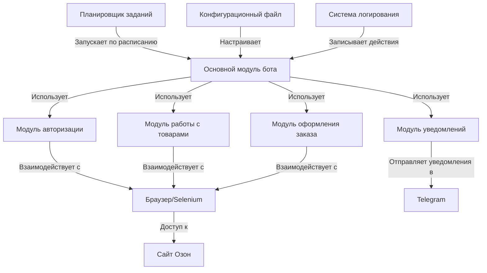
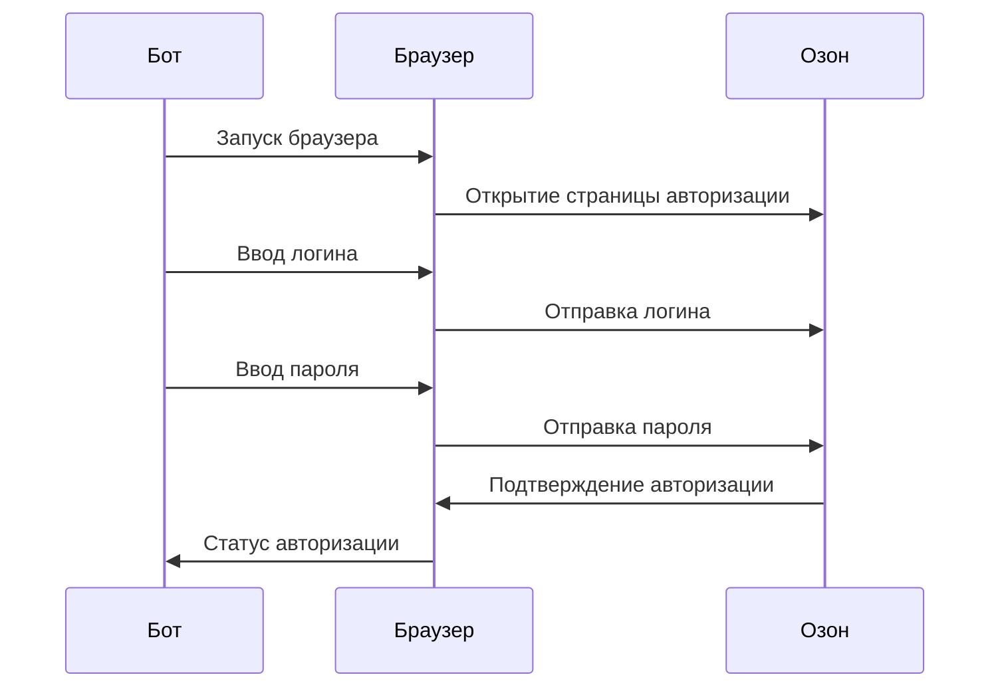
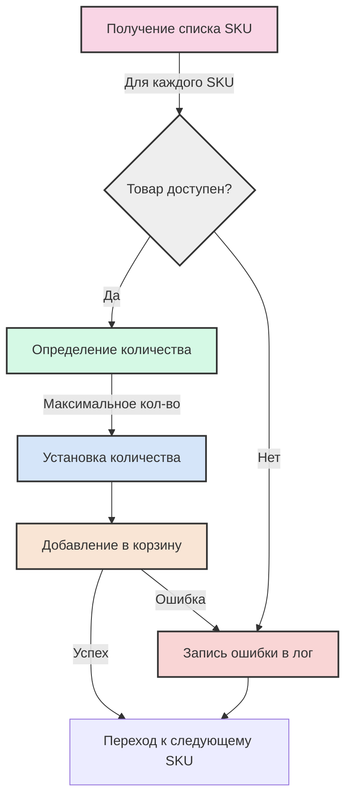
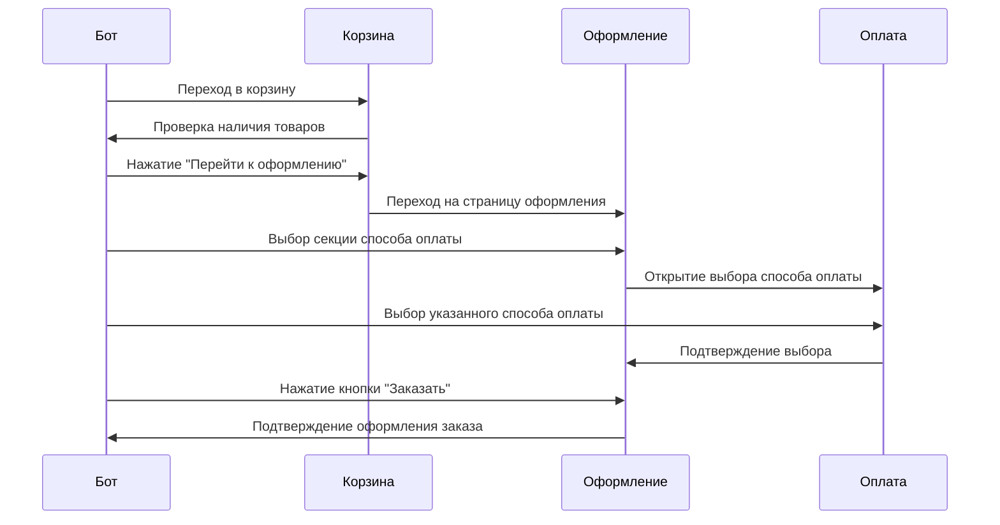
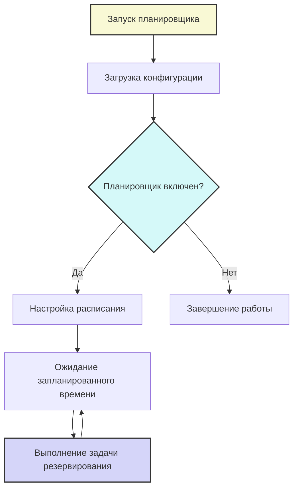

# Спецификация бота для автоматического резерва товаров на Озон

## Общее описание

Бот для автоматического резервирования товаров на маркетплейсе Озон представляет собой программное решение, которое позволяет продавцам автоматизировать процесс резервирования товаров на складе. Бот выполняет полный цикл действий: авторизуется в личном кабинете Озон, добавляет товары в корзину, переходит к оформлению заказа, выбирает указанный способ оплаты и завершает процесс резервирования.

## Архитектура решения

## Функциональные требования (BDD спецификация)

### Сценарий 1: Авторизация на сайте Озон

**Функция:** Авторизация в личном кабинете Озон

**Как:** авторизованный пользователь  
**Я хочу:** автоматически входить в личный кабинет Озон  
**Чтобы:** иметь доступ к функциям резервирования товаров

**Сценарий:** Успешная авторизация на сайте
- **Дано:** конфигурационный файл с корректными данными для входа
- **Когда:** бот запускает процесс авторизации
- **Тогда:** он должен успешно войти в личный кабинет
- **И:** сохранить статус авторизации для дальнейших операций

**Сценарий:** Неуспешная авторизация на сайте
- **Дано:** конфигурационный файл с некорректными данными для входа
- **Когда:** бот запускает процесс авторизации
- **Тогда:** он должен обнаружить ошибку авторизации
- **И:** записать информацию об ошибке в лог
- **И:** отправить уведомление об ошибке (если настроено)

### Сценарий 2: Добавление товаров в корзину

**Функция:** Добавление товаров в корзину

**Как:** продавец на Озон  
**Я хочу:** автоматически добавлять товары в корзину  
**Чтобы:** подготовить их к резервированию

**Сценарий:** Успешное добавление товаров в корзину
- **Дано:** список доступных SKU товаров в конфигурации
- **Когда:** бот начинает процесс добавления товаров
- **Тогда:** он должен открыть страницу каждого товара
- **И:** определить доступное количество каждого товара
- **И:** добавить максимальное количество каждого товара в корзину
- **И:** проверить, что все товары успешно добавлены

**Сценарий:** Обработка недоступных товаров
- **Дано:** список SKU, содержащий недоступные товары
- **Когда:** бот пытается добавить недоступный товар
- **Тогда:** он должен зафиксировать информацию об ошибке
- **И:** продолжить обработку следующих товаров в списке
- **И:** записать статистику по доступным и недоступным товарам

### Сценарий 3: Оформление заказа

**Функция:** Оформление заказа с выбором способа оплаты

**Как:** покупатель на Озон  
**Я хочу:** автоматически оформлять заказ с выбранным способом оплаты  
**Чтобы:** завершить процесс резервирования товаров

**Сценарий:** Успешное оформление заказа
- **Дано:** корзина содержит товары для резервирования
- **И:** в конфигурации указан предпочтительный способ оплаты
- **Когда:** бот начинает процесс оформления заказа
- **Тогда:** он должен перейти к оформлению
- **И:** выбрать указанный способ оплаты
- **И:** подтвердить оформление заказа
- **И:** проверить успешное завершение оформления
- **И:** получить и сохранить номер заказа
- **И:** отправить уведомление об успешном резервировании (если настроено)

**Сценарий:** Ошибка при оформлении заказа
- **Дано:** корзина содержит товары для резервирования
- **Когда:** бот сталкивается с ошибкой в процессе оформления
- **Тогда:** он должен сделать скриншот страницы с ошибкой
- **И:** записать информацию об ошибке в лог
- **И:** отправить уведомление о неуспешном резервировании (если настроено)

### Сценарий 4: Работа планировщика задач

**Функция:** Автоматический запуск по расписанию

**Как:** владелец бота  
**Я хочу:** настраивать расписание автоматического запуска бота  
**Чтобы:** регулярно резервировать товары без ручного вмешательства

**Сценарий:** Настройка и выполнение заданий по расписанию
- **Дано:** конфигурационный файл с настройками расписания
- **Когда:** планировщик запускается
- **Тогда:** он должен загрузить настройки расписания
- **И:** настроить запуск бота в указанное время
- **И:** выполнять задачи резервирования по расписанию
- **И:** корректно обрабатывать ошибки при выполнении задач
- **И:** продолжать работу до явной остановки пользователем

## Технические требования

### Требования к окружению
- Python 3.8 или выше
- Google Chrome или Chromium
- Доступ в интернет
- Минимум 512 МБ оперативной памяти

### Требования к безопасности
- Хранение учетных данных в локальном конфигурационном файле
- Отсутствие передачи учетных данных третьим сторонам
- Логирование всех действий для аудита

### Требования к производительности
- Способность обрабатывать до 10 SKU за одну сессию
- Возможность работы в фоновом режиме (headless)
- Минимизация использования ресурсов при ожидании запланированного запуска

## План внедрения и технической поддержки

1. **Установка и настройка** - 1 день
   - Установка необходимых компонентов
   - Настройка конфигурационного файла
   - Тестовый запуск в ручном режиме

2. **Настройка автоматического запуска** - 1 день
   - Настройка расписания
   - Тестирование автоматического запуска
   - Настройка уведомлений

3. **Техническая поддержка** - постоянно
   - Мониторинг журналов и уведомлений
   - Обновление в случае изменений на сайте Озон
   - Решение возникающих проблем