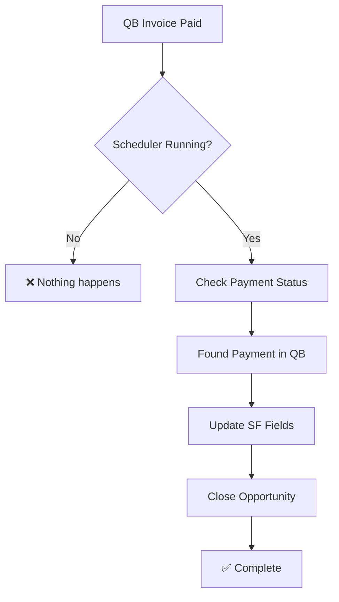
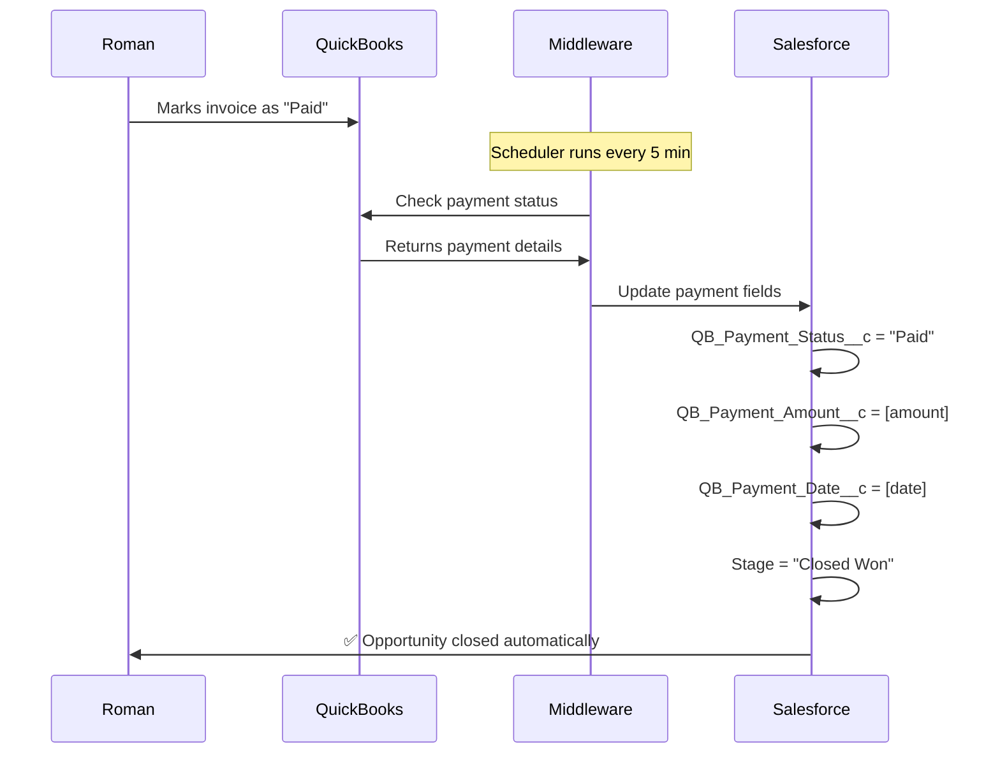

# 🔄 CRITICAL HANDOFF: QuickBooks Payment Sync Back to Salesforce

## 📅 Date: August 24, 2025
## 👤 Client: Roman Kapralov  
## 💰 Project: Salesforce-QuickBooks Integration (30,000 RUB on completion)
## 🎯 Current Status: 70% Complete - Invoice Creation Works, Payment Sync BROKEN

---

## 🚨 CRITICAL ISSUES FROM ROMAN'S TESTING

### ✅ What's Working:
1. **Invoice Creation**: QB invoices created successfully from Salesforce
2. **Invoice Numbers**: Using Salesforce Opportunity ID as DocNumber (e.g., 006So00000R4V7KIAV)
3. **Products**: Being created correctly in QB
4. **Customer Creation**: Working properly

### ❌ What's BROKEN:
1. **Payment Sync Back**: When Roman marks invoice as "Paid" in QB, nothing happens in Salesforce
2. **Missing Fields on Layout**: QB payment fields not visible on Opportunity page layout
3. **Auto-Close Not Working**: Opportunity should close when payment received
4. **Payment Link Error**: Error when trying to pay invoice via QB link
5. **Scheduler Not Running**: QBPaymentStatusScheduler may not be checking payments

---

## 🔍 ROMAN'S EXACT FEEDBACK (TRANSLATED)

| Time | Russian | English | Issue |
|------|---------|---------|-------|
| 13:54 | "пришло в QB" | "arrived in QB" | ✅ Invoice creation works |
| 13:54 | "этот номер как формируется?" | "how is this number formed?" | 📝 Asking about invoice numbering |
| 13:59 | "при оплате счета по ссылке ошибка" | "error when paying invoice via link" | ❌ Payment link broken |
| 14:09 | "Этих полей на форме Сделки нет" | "These fields aren't on the Opportunity form" | ❌ Missing QB fields on layout |
| 14:09 | "я поменял статус на оплачен - сделка должна закрыться" | "I changed status to paid - opportunity should close" | ❌ Payment sync not working |
| 14:23 | "Должны прилететь поля эти и сделка закрыться" | "Fields should update and opportunity should close" | ❌ Auto-close not working |

---

## 📂 CURRENT FILE STRUCTURE & STATUS

### ✅ WORKING FILES (Don't change these):
```
/deployment/sf-qb-integration-final/
├── src/transforms/opportunity-to-invoice.js    ✅ UPDATED - Dynamic ItemRef working
├── src/services/quickbooks-api.js             ✅ UPDATED - getFirstAvailableItem() added
├── src/routes/api.js                          ✅ UPDATED - Response parsing fixed
└── src/services/oauth-manager.js              ⚠️  Token saving permission issues
```

### ❌ BROKEN/MISSING COMPONENTS:
```
/deployment/sf-qb-integration-final/
├── src/services/scheduler.js                  ❌ Payment check scheduler NOT working
├── src/routes/api.js                         ❌ /check-payment-status endpoint broken
└── src/services/salesforce-api.js            ❌ updateOpportunityPaymentStatus() missing
```

### 📦 Salesforce Components Status:
```
force-app/main/default/
├── classes/
│   ├── QBInvoiceIntegrationQueueable.cls     ✅ Working (creates invoices)
│   ├── QBPaymentStatusScheduler.cls          ❌ NOT scheduled/running
│   └── QuickBooksAPIServiceFixed.cls         ❓ May need payment check methods
├── triggers/
│   └── OpportunityQuickBooksTrigger.trigger  ✅ Working (fires on stage change)
└── objects/Opportunity/fields/
    ├── QB_Invoice_ID__c.field                ✅ Working, populated
    ├── QB_Payment_Status__c.field            ❌ NOT updating from QB
    ├── QB_Payment_Amount__c.field            ❌ NOT updating from QB
    ├── QB_Payment_Date__c.field              ❌ NOT updating from QB
    └── QB_Payment_Method__c.field            ❌ NOT updating from QB
```

---

## 🔧 WHAT NEEDS TO BE FIXED

### 1. **Schedule Payment Status Checker** (PRIORITY 1)
The QBPaymentStatusScheduler needs to be scheduled to run every 5 minutes:

```apex
// Execute in Developer Console to schedule
QBPaymentStatusScheduler scheduler = new QBPaymentStatusScheduler();
String cronExp = '0 */5 * * * ?'; // Every 5 minutes
System.schedule('QB Payment Status Check', cronExp, scheduler);
```

### 2. **Add Fields to Opportunity Page Layout** (PRIORITY 2)
Missing fields on Opportunity layout:
- QB_Invoice_ID__c
- QB_Payment_Status__c  
- QB_Payment_Amount__c
- QB_Payment_Date__c
- QB_Payment_Method__c

**Navigation**: Setup → Object Manager → Opportunity → Page Layouts → Edit

### 3. **Fix Payment Status Check API** (PRIORITY 3)
The middleware endpoint `/api/check-payment-status` needs to:
1. Query Salesforce for unpaid invoices
2. Check each invoice status in QuickBooks
3. Update Salesforce when payment found
4. Auto-close Opportunity when fully paid

### 4. **Test Payment Sync Flow** (PRIORITY 4)


---

## 🚀 IMMEDIATE ACTIONS REQUIRED

### Step 1: Check if Scheduler is Running
```apex
// Check scheduled jobs
List<CronTrigger> jobs = [SELECT Id, CronJobDetail.Name, State, NextFireTime 
                          FROM CronTrigger 
                          WHERE CronJobDetail.Name LIKE '%Payment%'];
for(CronTrigger job : jobs) {
    System.debug(job.CronJobDetail.Name + ' - ' + job.State + ' - Next: ' + job.NextFireTime);
}
```

### Step 2: Test Payment Check Manually
```bash
curl -X POST https://sqint.atocomm.eu/api/check-payment-status \
  -H "X-API-Key: UPCzgiXsPuXB4GiLuuzjqtXY4+4mGt+vXOmU4gaNCvM=" \
  -H "Content-Type: application/json" \
  -d '{
    "salesforceInstance": "https://customer-inspiration-2543.my.salesforce.com",
    "quickbooksRealm": "9130354519120066"
  }'
```

### Step 3: Check Server Logs for Errors
```bash
sshpass -p '3Sd5R069jvuy[3u6yj' ssh -p2323 roman@pve.atocomm.eu \
  'tail -100 /opt/qb-integration/server.log | grep -i payment'
```

---

## 💡 KEY INSIGHTS FOR NEXT AGENT

### What We Know:
1. **One-Way Works**: SF → QB invoice creation is 100% working
2. **Return Path Broken**: QB → SF payment status NOT syncing
3. **Fields Exist**: Payment fields created but not on page layout
4. **Roman's Testing**: He manually marked invoice as paid in QB, expected SF to update
5. **Invoice Numbering**: Using Opportunity ID as DocNumber (Roman asked about this)

### Critical Files to Review:
1. `/deployment/sf-qb-integration-final/src/services/scheduler.js` - Payment check logic
2. `/force-app/main/default/classes/QBPaymentStatusScheduler.cls` - SF scheduler
3. `/deployment/sf-qb-integration-final/src/routes/api.js` - check-payment-status endpoint

### Environment Details:
- **Salesforce Org**: https://customer-inspiration-2543.my.salesforce.com
- **QuickBooks Realm**: 9130354519120066
- **Middleware**: https://sqint.atocomm.eu (running)
- **API Key**: UPCzgiXsPuXB4GiLuuzjqtXY4+4mGt+vXOmU4gaNCvM=

---

## 📊 SUCCESS CRITERIA FOR COMPLETION

Roman expects this flow to work:


---

## ⚠️ WARNINGS FOR NEXT AGENT

1. **DON'T** modify the working invoice creation flow
2. **DON'T** change QB_Integration_Settings__c (API key is correct)
3. **DON'T** redeploy OpportunityQuickBooksTrigger (it works)
4. **DO** focus ONLY on payment sync back from QB to SF
5. **DO** ensure scheduler is running every 5 minutes
6. **DO** add fields to Opportunity page layout

---

## 📞 ROMAN'S EXPECTATIONS

1. When invoice paid in QB → Opportunity auto-closes in SF
2. Payment fields visible on Opportunity page
3. Payment status syncs within 5 minutes
4. No manual intervention required

---

## 🔑 CREDENTIALS & ACCESS

### Salesforce:
- **URL**: https://customer-inspiration-2543.my.salesforce.com
- **User**: olga.rybak@atocomm2023.eu
- **Password**: 0mj3DqPv28Dp2

### Server SSH:
- **Command**: `sshpass -p '3Sd5R069jvuy[3u6yj' ssh -p2323 roman@pve.atocomm.eu`
- **Middleware Path**: `/opt/qb-integration/`

### QuickBooks:
- **URL**: https://qbo.intuit.com
- **Company**: Mark Comm LLC
- **Realm ID**: 9130354519120066

---

## 🎯 FINAL GOAL

**Make the integration BIDIRECTIONAL:**
- ✅ Salesforce → QuickBooks (WORKING)
- ❌ QuickBooks → Salesforce (NEEDS FIXING)

When Roman marks an invoice as paid in QuickBooks, the Salesforce Opportunity should automatically:
1. Update payment fields
2. Change stage to "Closed Won"
3. Show payment details

**This is the final 30% to complete the project and receive payment.**

---

*Last Updated: August 24, 2025 02:30 AM*
*Next Agent Action: Fix payment sync scheduler and test bidirectional flow*