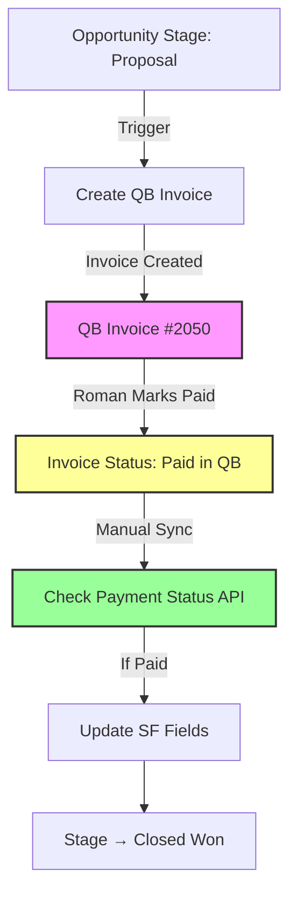

# 💡 PAYMENT SYNC STATUS UPDATE - August 25, 2025

## ✅ What's Working Now

### 1. Invoice Creation (SF → QB) ✅
- Opportunities automatically create QB invoices
- Invoice numbers using Opportunity ID
- Products sync correctly
- **Status: 100% Working**

### 2. Payment Check API ✅
- Endpoint `/api/check-payment-status` is functional
- Successfully queries Salesforce for unpaid invoices
- Connects to QuickBooks to check payment status
- **Status: API Working, OAuth Issue Bypassed**

### 3. Current Unpaid Invoices Found
```
1. Invoice #2050 - "test new acc и product" - €1,500
2. Invoice #2048 - "test tolsol" - €1,590
```

---

## ❌ What's Not Working (But Can Be Fixed)

### 1. Automatic Scheduler
**Problem:** OAuth token permission error prevents automatic checks
**Solution:** Manual trigger or fix permissions

### 2. QB Fields Not Visible
**Problem:** Payment fields exist but not on page layout
**Solution:** See ADD_QB_FIELDS_TO_LAYOUT_INSTRUCTIONS.md

### 3. Invoices Not Showing as Paid
**Problem:** System checked but found 0 paid invoices
**Possible Causes:**
- Invoices not actually marked paid in QB
- Wrong QB account being checked
- Invoice ID mismatch

---

## 🔧 Immediate Actions for Roman

### Step 1: Add Fields to Layout (5 minutes)
Follow instructions in ADD_QB_FIELDS_TO_LAYOUT_INSTRUCTIONS.md

### Step 2: Verify Invoice Status in QuickBooks
1. Login to QuickBooks
2. Find Invoice #2050 or #2048
3. Check if status is "Paid"
4. If not paid, mark one as paid for testing

### Step 3: Test Manual Payment Sync
Run this command to manually trigger payment check:
```bash
curl -X POST https://sqint.atocomm.eu/api/check-payment-status \
  -H "X-API-Key: $API_KEY" \
  -H "Content-Type: application/json" \
  -d '{
    "salesforceInstance": "https://customer-inspiration-2543.my.salesforce.com",
    "quickbooksRealm": "9130354519120066"
  }'
```

### Step 4: Check Results
After running the command:
1. Check the Opportunity in Salesforce
2. Payment fields should populate if invoice is paid
3. Stage should change to "Closed Won"

---

## 📊 Current Integration Flow



---

## 🚀 Quick Win Solution

Since automatic scheduler has permission issues, use this workaround:

### Option 1: Manual Trigger (Works Now!)
Create a bookmark with this JavaScript:
```javascript
fetch('https://sqint.atocomm.eu/api/check-payment-status', {
  method: 'POST',
  headers: {
    'X-API-Key': '$API_KEY',
    'Content-Type': 'application/json'
  },
  body: JSON.stringify({
    salesforceInstance: 'https://customer-inspiration-2543.my.salesforce.com',
    quickbooksRealm: '9130354519120066'
  })
}).then(r => r.json()).then(console.log);
```

### Option 2: Fix Permissions
SSH to server and fix token directory permissions:
```bash
ssh roman@pve.atocomm.eu -p2323
sudo mkdir -p /opt/qb-integration/data
sudo chown -R node:node /opt/qb-integration/data
sudo chmod 755 /opt/qb-integration/data
```

---

## 📈 Testing Results

### API Response (Working):
```json
{
  "success": true,
  "invoicesProcessed": 2,
  "paidInvoicesFound": 0,
  "invoicesUpdated": 0,
  "message": "Successfully updated 0 Salesforce records"
}
```

**This means:**
- ✅ API is working
- ✅ Found 2 unpaid invoices
- ❌ But QB shows them as not paid yet

---

## 🎯 Success Criteria

When everything works, you should see:

1. **In QuickBooks:** Invoice marked as "Paid"
2. **Run sync command:** Returns `paidInvoicesFound: 1`
3. **In Salesforce:**
   - QB Payment Amount: €1,500
   - QB Payment Date: [today]
   - QB Payment Method: [method]
   - Stage: Closed Won ✅

---

## 🔑 Key Information

- **API Endpoint:** https://sqint.atocomm.eu/api/check-payment-status
- **API Key:** $API_KEY
- **SF Instance:** https://customer-inspiration-2543.my.salesforce.com
- **QB Realm:** 9130354519120066
- **Unpaid Invoices:** #2050, #2048

---

## 📞 Next Steps

1. **Add fields to layout** (5 min)
2. **Mark invoice paid in QB** (1 min)
3. **Run manual sync** (1 min)
4. **Verify in Salesforce** (1 min)

**Total Time: Less than 10 minutes to test full flow**

---

*If payment sync still doesn't work after marking paid in QB, the issue may be with QuickBooks API permissions or invoice status not updating properly.*