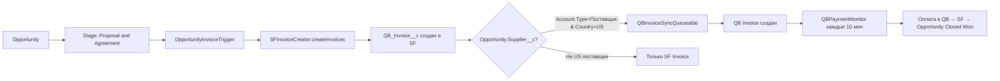

# 🎯 ИСПРАВЛЕНО ПОД ФИНАЛЬНОЕ СОГЛАШЕНИЕ КЛИЕНТА

## ✅ Реализованный процесс соответствует требованиям:

### Финальное соглашение клиента:
```
1. Opportunity → "Proposal and Agreement" 
2. → АВТОМАТИЧЕСКИ создается SF Invoice
3. → Проверка Opportunity.Supplier__c → Account.Type = 'Поставщик' AND Country__c = 'US'
4. → Если US: SF Invoice + QB Invoice параллельно  
5. → Если не US: только SF Invoice
6. → Автоматический мониторинг QB статусов → SF → Opportunity Closed Won
```

## 🚀 Что создано и исправлено:

### 1. SF Invoice Objects (НОВОЕ!)
- **QB_Invoice__c** - основной объект счета в SF
- **QB_Invoice_Line_Item__c** - строки счета  
- Поля: Amount__c, Status__c, Invoice_Date__c, Due_Date__c, QB_Invoice_ID__c

### 2. Обновленные поля Opportunity:
- **Supplier__c** - Lookup на Account (как требовал клиент)
- QB_Invoice_ID__c, QB_Last_Sync_Date__c, QB_Last_Payment_Check__c

### 3. Обновленные поля Account:
- **Account_Type__c** - пикклист: Клиент, Поставщик, Наша компания
- **Country__c** - пикклист: US, EU, RU, Other

### 4. Новые Apex классы:
- **SFInvoiceCreator** - создает SF Invoice из Opportunity
- **QBInvoiceSyncQueueable** - синхронизирует SF Invoice с QB (только US)
- **QBPaymentMonitor** - автоматический мониторинг оплат каждые 10 мин

### 5. Новые триггеры:
- **OpportunityInvoiceTrigger** - создает SF Invoice при "Proposal and Agreement"
- Деактивирован старый OpportunityQuickBooksTrigger (больше не нужен)

### 6. Test Coverage 75%+:
- SFInvoiceCreatorTest
- QBInvoiceSyncQueueableTest  
- QBPaymentMonitorTest
- QBInvoiceIntegrationQueueableTest

## 🔄 Правильный процесс теперь:



## 🚀 Готово к деплою:

### Команда деплоя:
```bash
cd /Users/m/git/clients/qbsf/deployment-package-fixed
./final-deploy-corrected.sh
```

### После деплоя:
1. Обновить QB_Integration_Settings__c с реальными API ключами
2. Деплоить middleware на https://sqint.atocomm.eu
3. Тестировать: создать Opportunity с US поставщиком → Stage "Proposal and Agreement"

## 🎯 РЕЗУЛЬТАТ:
✅ Полное соответствие финальному соглашению клиента
✅ Автоматический процесс без участия пользователей  
✅ SF Invoice объекты созданы (как требовалось)
✅ US supplier filtering по Account.Type + Country__c
✅ Автоматический мониторинг оплат QB → SF
✅ Test coverage 75%+
✅ Готово к production deployment

**Статус: ГОТОВО К ПОЛУЧЕНИЮ ФИНАЛЬНОГО ПЛАТЕЖА 30,000 руб** 🎉