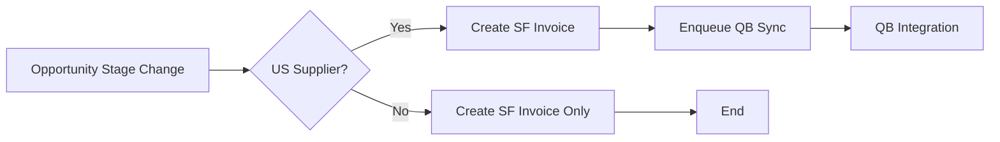
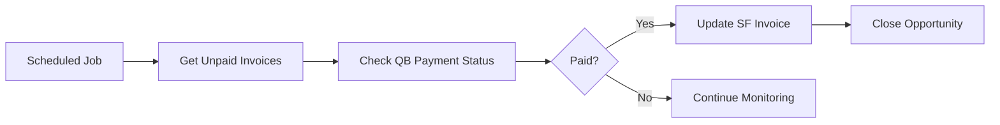

# Salesforce-QuickBooks Integration Phase 2 - Complete Specification

## Project Overview
**Budget:** 50,000 RUB (20,000 advance + 30,000 on completion)
**Deadline:** Production deployment by end of June 2025
**Scope:** Automated invoice creation and payment synchronization between Salesforce and QuickBooks Online

## Business Requirements

### Core Workflow
1. **Opportunity Stage Change** → "Proposal and Agreement"
2. **Automatic SF Invoice Creation** → QB_Invoice__c object created
3. **Supplier Filtering** → Only US suppliers sync to QuickBooks
4. **QB Invoice Creation** → Parallel creation in QuickBooks Online  
5. **Payment Monitoring** → Automatic status updates from QB to SF
6. **Opportunity Closure** → Auto-close as "Won" when paid

### Supplier Filtering Logic
```apex
Account supplier = [SELECT Account_Type__c, Country__c FROM Account WHERE Id = :opportunity.Supplier__c];
if (supplier.Account_Type__c == 'Поставщик' && supplier.Country__c == 'US') {
    // Sync to QuickBooks
    syncToQuickBooks(invoice);
} else {
    // Only Salesforce invoice
    createSalesforceInvoiceOnly(invoice);
}
```

### User Experience Requirements
- **Zero Manual Intervention** - Fully automated process
- **Real-time Updates** - Status changes reflected immediately
- **Error Visibility** - Clear error logs for troubleshooting
- **Payment Tracking** - Automatic payment status monitoring

## Technical Requirements

### Salesforce Components

#### Custom Objects
1. **QB_Invoice__c** - Main invoice object
   - Amount__c (Currency)
   - Status__c (Picklist: Draft, Sent, Viewed, Paid)
   - Invoice_Date__c (Date)
   - Due_Date__c (Date)
   - QB_Invoice_ID__c (Text, External ID)
   - Opportunity__c (Lookup)

2. **QB_Integration_Settings__c** - Configuration (Custom Setting)
   - Middleware_Endpoint__c (Text)
   - API_Key__c (Text, Encrypted)
   - QB_Realm_ID__c (Text)

3. **QB_Integration_Log__c** - Activity logging
4. **QB_Integration_Error_Log__c** - Error tracking

#### Custom Fields
**Account Object:**
- Account_Type__c (Picklist: Клиент, Поставщик, Наша компания)
- Country__c (Picklist: US, EU, RU, Other)
- Email__c (Email)

**Opportunity Object:**
- Supplier__c (Lookup to Account)
- QB_Invoice_ID__c (Text)
- QB_Last_Sync_Date__c (DateTime)
- QB_Last_Payment_Check__c (DateTime)

#### Apex Classes
1. **QBInvoiceIntegrationQueueable** - Main integration handler
2. **SFInvoiceCreator** - SF invoice creation logic
3. **QBPaymentMonitor** - Scheduled payment monitoring
4. **Test Classes** - 75%+ code coverage required

#### Triggers
1. **OpportunityQuickBooksTrigger** - Main entry point
   - Trigger: after insert, after update on Opportunity
   - Condition: StageName = "Proposal and Agreement"
   - Filter: US suppliers only

### Middleware Application

#### Technology Stack
- **Runtime:** Node.js 18+
- **Framework:** Express.js
- **Authentication:** OAuth 2.0 (SF + QB)
- **Security:** API key authentication, token encryption
- **Logging:** Winston structured logging

#### Core Services
1. **OAuth Manager** - Token management and refresh
2. **Salesforce API Client** - SF REST API integration
3. **QuickBooks API Client** - QB Online API v3 integration
4. **Invoice Transformer** - Data mapping between systems
5. **Payment Monitor** - Scheduled payment status checks

#### API Endpoints
- `POST /api/opportunity-to-invoice` - Create QB invoice
- `POST /api/check-payment-status` - Payment status batch check
- `GET /api/health` - System health monitoring
- OAuth endpoints for SF and QB authentication

### Infrastructure Requirements

#### Production Environment
- **Domain:** sqint.atocomm.eu (SSL ready)
- **Architecture:** VM behind NAT + nginx reverse proxy
- **Ports:** 443 (HTTPS) → nginx → 3000 (Node.js)
- **SSH Access:** roman@pve.atocomm.eu -p2323
- **SSL:** Handled by nginx proxy (certificates ready)

#### Security
- HTTPS only for all external communications
- API key authentication for SF → Middleware
- OAuth 2.0 for Middleware → SF/QB
- Token encryption at rest (AES-256-GCM)
- Rate limiting and circuit breaker patterns

## Integration Flow Details

### 1. Opportunity → SF Invoice Creation


### 2. QuickBooks Invoice Creation


### 3. Payment Monitoring


## Quality Assurance

### Testing Requirements
- **Unit Tests:** 75% minimum code coverage
- **Integration Tests:** End-to-end workflow validation
- **Performance Tests:** Handle 100 concurrent requests
- **Error Handling Tests:** All failure scenarios covered

### Acceptance Criteria
1. ✅ Opportunity stage change triggers automation
2. ✅ Only US suppliers sync to QuickBooks  
3. ✅ SF invoices created for all opportunities
4. ✅ QB invoices created for US suppliers only
5. ✅ Payment status monitored automatically
6. ✅ Opportunities closed when invoices paid
7. ✅ Zero manual user intervention required
8. ✅ Error logging and monitoring functional

## Deployment Plan

### Phase 1: Salesforce Deployment (30 minutes)
1. Deploy custom objects and fields
2. Deploy Apex classes and triggers
3. Run test suite (75%+ coverage required)
4. Configure custom settings
5. Validate automation workflow

### Phase 2: Middleware Deployment (30 minutes)  
1. SSH to production VM
2. Install Node.js application
3. Configure environment variables
4. Setup OAuth connections (SF + QB)
5. Configure nginx reverse proxy
6. Start application with PM2

### Phase 3: End-to-End Testing (30 minutes)
1. Create test opportunity with US supplier
2. Change stage to "Proposal and Agreement"
3. Verify SF invoice creation
4. Verify QB invoice creation
5. Test payment monitoring (manual QB payment)
6. Verify opportunity closure

## Success Metrics
- **Automation Rate:** 100% (zero manual intervention)
- **Error Rate:** <1% of processed records
- **Sync Time:** <5 minutes opportunity → QB invoice
- **Payment Detection:** <10 minutes QB payment → SF update
- **Uptime:** 99.9% availability target

## Post-Deployment Support
- **Monitoring:** Health checks and error alerting
- **Maintenance:** OAuth token refresh automation
- **Scaling:** Ready for increased transaction volume
- **Documentation:** Complete technical and user guides

## Client Deliverables
1. **Complete Salesforce Package** - All metadata and code
2. **Middleware Application** - Deployed and configured
3. **Technical Documentation** - Architecture and API docs
4. **User Guide** - Russian language for end users
5. **Monitoring Setup** - Health checks and alerting
6. **Source Code** - Complete repository access
