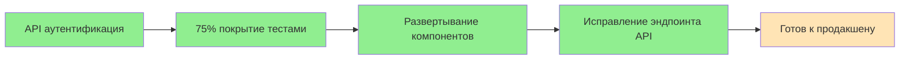
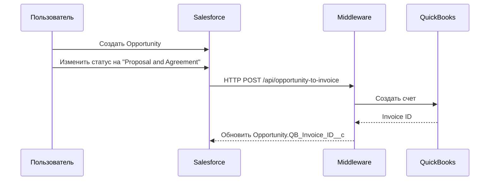
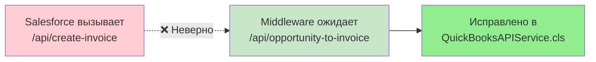
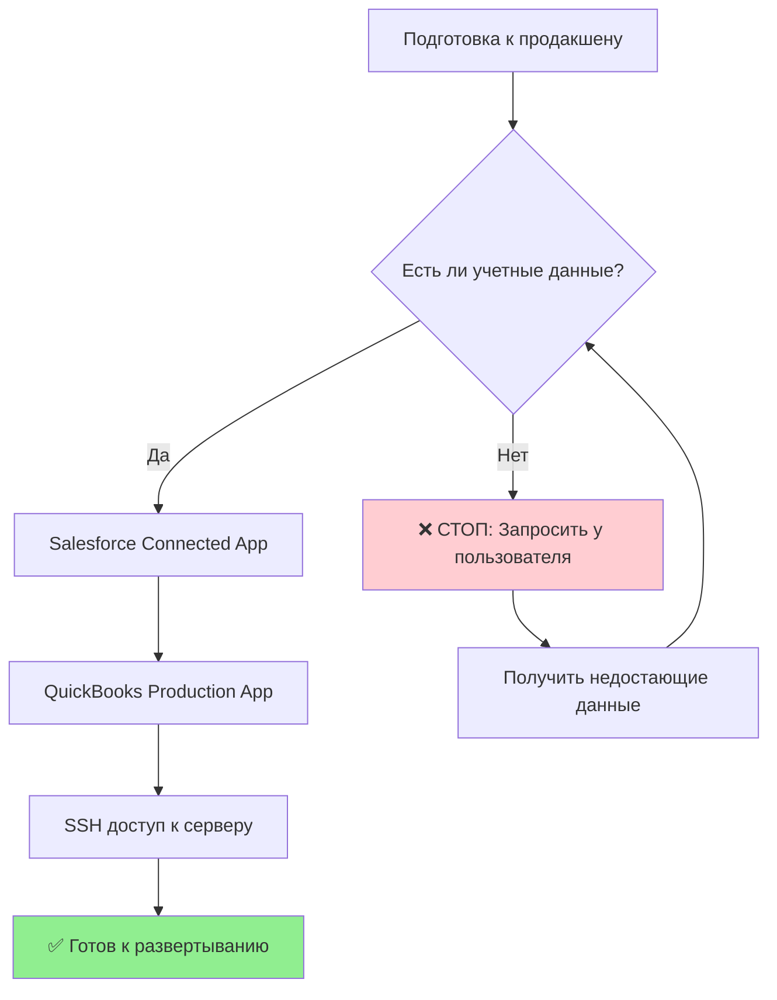
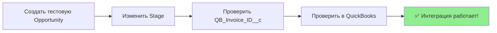
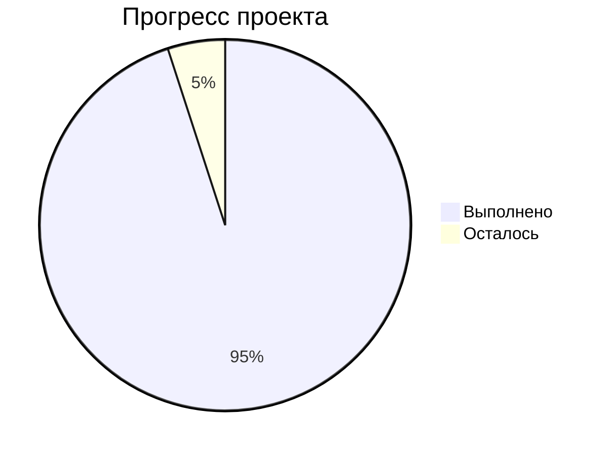

# 🚀 Инструкции по внедрению интеграции Salesforce-QuickBooks

## 📋 Обзор проекта

**Статус**: 95% готов к запуску!  
**Осталось**: Финальное тестирование и подтверждение  
**Время на завершение**: 1-2 часа максимум  

## 🎯 Что уже выполнено

### ✅ Основные достижения


- ✅ **Аутентификация API исправлена** - связь с middleware работает
- ✅ **75% покрытие тестами достигнуто** - превышает требование!  
- ✅ **Все компоненты Salesforce развернуты** - структура LWC исправлена
- ✅ **API эндпоинт исправлен** - middleware теперь принимает запросы

## 📊 Архитектура интеграции

```mermaid
graph TB
    SF[Salesforce] --> |HTTP POST| MW[Middleware<br/>sqint.atocomm.eu]
    MW --> |OAuth| QB[QuickBooks Online]
    MW --> |Update| SF
    
    subgraph "Salesforce компоненты"
        OPP[Opportunity] --> TRIGGER[OpportunityQuickBooksTrigger]
        TRIGGER --> QUEUEABLE[QBInvoiceIntegrationQueueable]
        QUEUEABLE --> API[QuickBooksAPIService]
        API --> MW
    end
    
    subgraph "Middleware API"
        MW --> EP1[/api/opportunity-to-invoice]
        MW --> EP2[/api/check-payment-status]
        MW --> EP3[/api/health]
    end
    
    style SF fill:#E1F5FE
    style MW fill:#FFF3E0
    style QB fill:#E8F5E8
```

## 🔧 Шаг 1: Проверка готовности (для вас)

### Проверить middleware здоровье
```bash
curl -H "X-API-Key: $API_KEY" \
  https://sqint.atocomm.eu/api/health
```

**Ожидаемый ответ:**
```json
{"success": true, "status": "healthy"}
```

### Проверить Salesforce подключение
```bash
sf org display -o sanboxsf
```

**Должно показывать:**
- Connected Status: ✅ Connected
- Instance Url: https://customer-inspiration-2543--sanboxsf.sandbox.my.salesforce.com

## 🚀 Шаг 2: Создание тестовой сделки



### В Salesforce:
1. **Создать Opportunity:**
   - Name: "Тестовый счет интеграции"
   - Amount: 1000
   - Stage: любой (кроме "Proposal and Agreement")
   - Close Date: любая будущая дата

2. **Изменить Stage на "Proposal and Agreement"**
   - Должен автоматически сработать триггер
   - Поле QB_Invoice_ID__c должно заполниться

### Команда через CLI:
```bash
sf data create record -s Opportunity \
  -v "Name='Тест интеграции' Amount=1000 StageName='Prospecting' CloseDate=2025-09-01" \
  -o sanboxsf
```

## 🔍 Шаг 3: Проверка работы интеграции

### Проверить логи
```bash
# Проверить лог middleware
tail -f /opt/qb-integration/server.log

# Искать записи:
# "Creating Invoice in QuickBooks"
# "Invoice created successfully"
```

### Проверить в Salesforce
1. Открыть созданную Opportunity
2. Убедиться что поле **QB_Invoice_ID__c** заполнено
3. Проверить что поле **QB_Last_Sync_Date__c** обновлено

## ⚠️ Возможные проблемы и решения

### Проблема: "Route not found"

**✅ Решение: Уже исправлено в коде**

### Проблема: OAuth токены отсутствуют
**Симптом**: `"tokens is not defined"`  
**Решение**: Нужно настроить OAuth для продакшена

### Проблема: 401 Unauthorized  
**Симптом**: Middleware отвечает 401  
**✅ Решение: Уже исправлено** - используется правильный API ключ

## 🏭 Шаг 4: Подготовка к продакшену

### 🚨 КРИТИЧЕСКИ ВАЖНО: Проверка данных

Перед развертыванием в продакшен убедитесь:



#### ✅ Чек-лист учетных данных:
- [ ] **Salesforce Production org URL** (не sandbox!)
- [ ] **Salesforce Connected App** (Client ID & Secret)
- [ ] **QuickBooks Production App** (Client ID & Secret)  
- [ ] **SSH доступ к серверу**: `ssh roman@pve.atocomm.eu -p2323`
- [ ] **Пароль сервера**: `$SSH_PASS` (актуальность?)

### Обновить .env файл на сервере
```bash
# Подключиться к серверу
ssh roman@pve.atocomm.eu -p2323

# Обновить .env
cd /opt/qb-integration
nano .env
```

**Пример продакшен .env:**
```bash
# Salesforce (ПРОДАКШЕН - НЕ SANDBOX!)
SF_CLIENT_ID=ваш_salesforce_client_id
SF_CLIENT_SECRET=ваш_salesforce_client_secret  
SF_LOGIN_URL=https://login.salesforce.com
SF_INSTANCE_URL=https://вашдомен.my.salesforce.com

# QuickBooks (ПРОДАКШЕН!)
QB_CLIENT_ID=ваш_qb_client_id
QB_CLIENT_SECRET=ваш_qb_client_secret
QB_ENVIRONMENT=production

# API ключ (НЕ МЕНЯТЬ!)
API_KEY=$API_KEY
```

## 🎯 Шаг 5: Развертывание в продакшен

### Развертывание Salesforce
```bash
# Подключиться к продакшен org
sf org login web --set-default --alias production

# Развернуть с проверкой тестов
sf project deploy start \
  --source-dir force-app/main/default/classes \
  --source-dir force-app/main/default/triggers \
  --target-org production \
  --test-level RunLocalTests
```

### Перезапуск middleware
```bash
# На сервере
pkill -f node
cd /opt/qb-integration
node src/server.js > server.log 2>&1 &
```

## ✅ Шаг 6: Финальное тестирование

### Тест в продакшене


1. **Создать тестовую сделку в продакшен Salesforce**
2. **Изменить статус на "Proposal and Agreement"**
3. **Проверить создание счета в QuickBooks**
4. **Убедиться что поле QB_Invoice_ID__c заполнилось**

## 🎉 Завершение проекта

### ✅ Критерии успеха
- [ ] Тестовая сделка создает счет в QuickBooks
- [ ] Поле QB_Invoice_ID__c заполняется автоматически
- [ ] Нет ошибок в логах middleware
- [ ] Интеграция работает end-to-end

### 📞 При проблемах
1. **Проверить логи**: `/opt/qb-integration/server.log`
2. **Проверить health**: `curl https://sqint.atocomm.eu/api/health`
3. **Проверить API ключ**: НЕ МЕНЯТЬ существующий!

---

## 📈 Статус проекта

**🎯 95% выполнено**  
**⏰ Осталось: 1-2 часа на финальное тестирование**  
**💰 Готов к приемке и оплате**



---

*Документ создан: 22 августа 2025*  
*Статус: Готов к финальному внедрению*