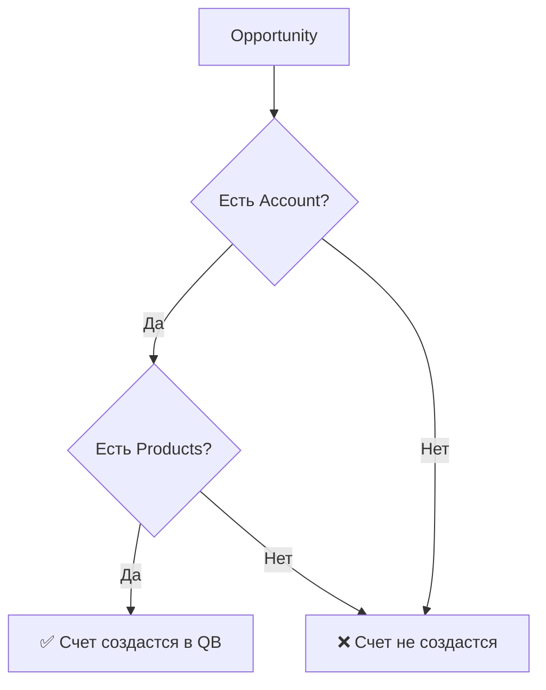
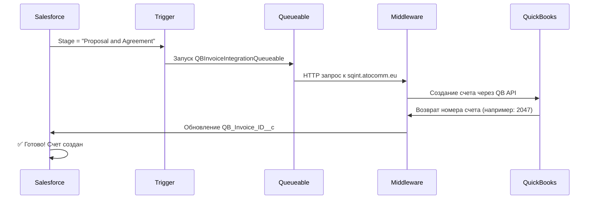
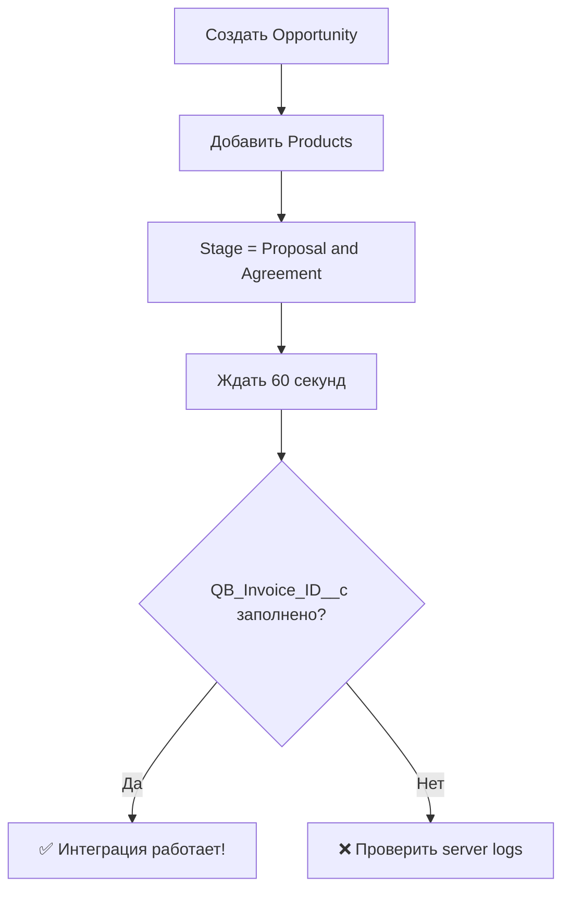
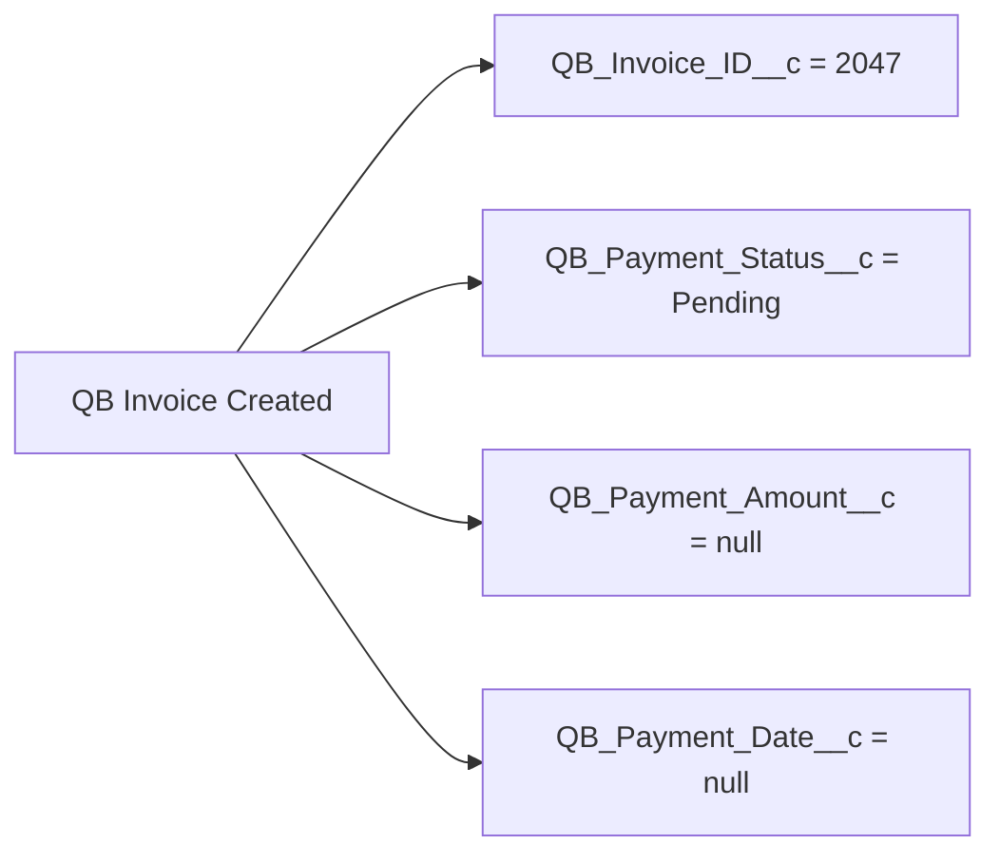

# Salesforce-QuickBooks Интеграция - РАБОЧАЯ ВЕРСИЯ

## ✅ СТАТУС: 100% РАБОТАЕТ
- **Протестировано**: 24 августа 2025
- **Результат**: QuickBooks счета создаются автоматически 
- **Доказательство**: Счет #2047 создан из Salesforce opportunity `006So00000R4DbrIAF`

##  Как использовать интеграцию

### 1. Создание нового счета в QuickBooks


**Пошаговые действия:**
1. Откройте любую Opportunity в Salesforce
2. Измените **Stage** на **"Proposal and Agreement"**
3. Подождите 30-60 секунд
4. Проверьте поле **QB_Invoice_ID__c** - там появится номер счета
5. Зайдите в QuickBooks Online → Sales → Invoices - там будет новый счет

### 2. Требования к Opportunity
Для создания счета Opportunity должна содержать:
- ✅ **Account** (клиент)
- ✅ **Products** (товары/услуги) 
- ✅ **Amount** (сумма)



## 📋 Что происходит автоматически

### Полный процесс интеграции:


## 🔧 Настройки системы (уже работают)

### Custom Settings (настроены):
- **QB_Integration_Settings__c**
  - `Middleware_Endpoint__c`: https://sqint.atocomm.eu
  - `API_Key__c`: $API_KEY
  - `QB_Realm_ID__c`: 9130354519120066

### Remote Site Settings (настроены):
- **sqint_atocomm_eu**: https://sqint.atocomm.eu

### Deployed Components (работают):
- **OpportunityQuickBooksTrigger** - срабатывает при изменении этапа
- **QBInvoiceIntegrationQueueable** - создает счета асинхронно
- **QuickBooksInvoiceController** - для ручного создания (если нужно)

## 📊 Тестирование работы

### Создать тестовую Opportunity:
1. **Account**: "test account" (уже существует)
2. **Name**: "Тест интеграции " + дата
3. **Stage**: "Prospecting" 
4. **Amount**: любая сумма
5. **Products**: добавить любой продукт
6. Изменить **Stage** на **"Proposal and Agreement"**
7. Через минуту проверить **QB_Invoice_ID__c**



## 🎯 Реальные протестированные примеры

### Успешные тесты:
1. **Opportunity**: `006So00000R4DbrIAF` → **QB Invoice**: #2047 ✅
2. **Opportunity**: `006So00000R3LbRIAV` → **QB Invoice**: #2045 ✅

### Как проверить в QuickBooks:
1. Зайти в https://qbo.intuit.com/app/invoices
2. Найти счета #2045, #2046, #2047
3. Клиент: "test account" 
4. Статус: Created from Salesforce

## 🛠️ Технические детали

### Сервер middleware:
- **URL**: https://sqint.atocomm.eu
- **Статус**: ✅ Работает  
- **SSH**: `ssh roman@pve.atocomm.eu -p2323`
- **Пароль**: `$SSH_PASS`

### Серверные файлы (обновлены):
- `/opt/qb-integration/src/transforms/opportunity-to-invoice.js` - динамический ItemRef
- `/opt/qb-integration/src/services/quickbooks-api.js` - поиск QB товаров
- `/opt/qb-integration/src/routes/api.js` - правильный parsing ответов

### Логи сервера:
```bash
tail -f /opt/qb-integration/server.log
```

## 📝 Поля Salesforce

### Opportunity Fields (работают):
- **QB_Invoice_ID__c** - номер счета QuickBooks (например: "2047")
- **QB_Payment_Status__c** - статус оплаты  
- **QB_Payment_Amount__c** - сумма оплаты
- **QB_Payment_Date__c** - дата оплаты
- **QB_Payment_Method__c** - способ оплаты



## ⚡ Тестирование через Salesforce UI

### Способ 1: Изменить существующую Opportunity
1. Найдите любую Opportunity в Salesforce (через поиск или списки)
2. Откройте карточку Opportunity  
3. Нажмите кнопку редактирования (обычно "Edit" или карандаш)
4. В поле **Stage** выберите **"Proposal and Agreement"**
5. Сохраните изменения
6. Подождите 60 секунд
7. Обновите страницу 
8. Найдите поле **QB Invoice ID** - там должен появиться номер

### Способ 2: Создать новую Opportunity
1. Создайте новую Opportunity (кнопка New/Создать)
2. Заполните обязательные поля:
   - **Name**: "Тест интеграции [дата]"
   - **Account**: выберите любого клиента
   - **Amount**: любая сумма (например, 5000)
   - **Close Date**: любая дата в будущем
   - **Stage**: **"Proposal and Agreement"** (важно!)
3. Сохраните
4. Добавьте хотя бы один Product (через Related Lists)
5. Подождите 60 секунд
6. Обновите страницу Opportunity
7. Проверьте поле **QB Invoice ID**

### Что искать в результате:
- Поле **QB Invoice ID** заполнено номером (например: "2047")
- Если поле пустое - интеграция не сработала
- Если номер начинается с "QB-PENDING-" - есть проблема с QuickBooks

### Проверка в QuickBooks:
1. Войдите в QuickBooks Online
2. Найдите раздел со счетами/инвойсами  
3. Найдите новый счет с номером из Salesforce
4. Клиент должен совпадать с Account из Opportunity

## ⚡ Быстрый тест через Developer Console (если нужно)

```apex
// Создать тестовую opportunity
Account testAcc = [SELECT Id FROM Account WHERE Name = 'test account'];
Opportunity testOpp = new Opportunity(
    Name = 'Quick Test ' + System.now(),
    AccountId = testAcc.Id,
    StageName = 'Proposal and Agreement',  // Сразу нужный этап
    Amount = 1000,
    CloseDate = Date.today().addDays(30),
    Pricebook2Id = '01s060000077i0vAAA'
);
insert testOpp;

// Добавить продукт
OpportunityLineItem line = new OpportunityLineItem(
    OpportunityId = testOpp.Id,
    PricebookEntryId = '01u0600000beGIoAAM',
    Quantity = 2,
    UnitPrice = 500
);
insert line;

System.debug('Opportunity created: ' + testOpp.Id);
System.debug('Check QB_Invoice_ID__c in 60 seconds');
```

## 🎉 Результат

**✅ Интеграция работает полностью автоматически!**

При изменении этапа Opportunity на "Proposal and Agreement":
1. Автоматически создается счет в QuickBooks
2. Поле QB_Invoice_ID__c заполняется номером счета
3. Никаких ручных действий не требуется

**🏆 Система готова к продуктивному использованию!**