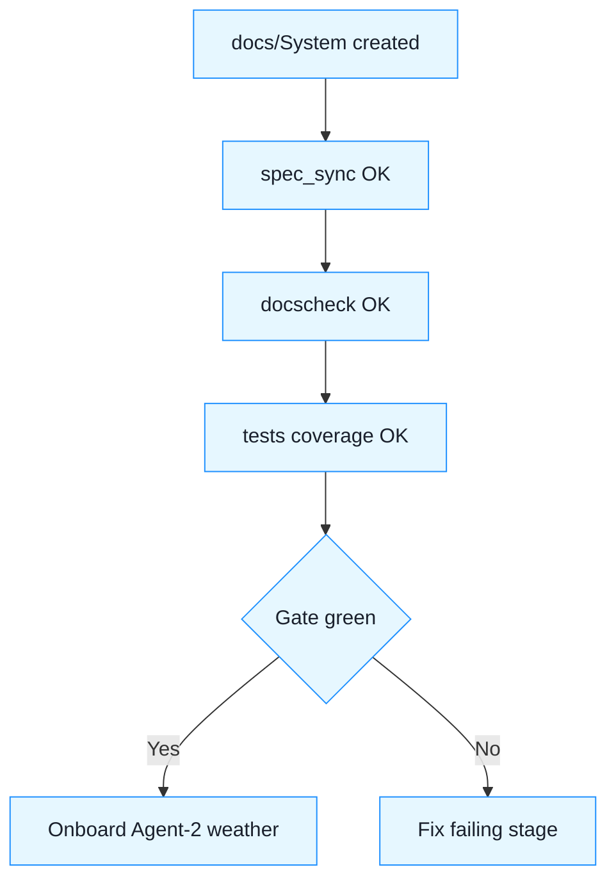

task for you  and a clean handoff model for bringing a second agent on weather.

------

## ✅ When are we “ready”

You’re ready the moment all **six checks** below pass in CI on `main`:

1. **Docs layout exists** under `docs/System/` with these files:
   - `CI_CD.md`, `Testing.md`, `Spec_Sync.md`, `Onboarding.md`, `Release.md`, `Repo_Layout.md`.
2. **Docs are machine‑checked** by a script in CI:
   - `.tools/docs_check.py` verifies required files + required headings + cross‑links resolve.
3. **Spec‑sync passes** (`.tools/spec_sync.py`) and emits `spec_registry/spec_index.yml`.
4. **Tests are green** (unit + e2e) and **coverage ≥ 85%** (no drop vs baseline).
5. **Region rule encoded** (client CSV region == districts sum; WARN debug CSVs exist) and asserted by tests.
6. **README index** points humans to `docs/System/` and the **order** to read them:
   - README → `docs/System/Onboarding.md` → `Testing.md` → `CI_CD.md`.

If (1)–(6) are true in CI, you can safely add a new agent without hand‑holding.

------

## docs/System: minimal skeleton (drop into repo)

**docs/System/Onboarding.md**

```md
# Onboarding
## Goal
Get a new contributor productive in <30 min: run tests, understand specs, and create a forecast delivery.

## Steps
1. Clone repo; `pip install -r requirements.txt -r requirements-dev.txt`
2. Run tests: `pytest -q --cov=scripts --cov-report=term-missing`
3. Run spec sync: `python .tools/spec_sync.py` (must be OK)
4. Docs check: `python .tools/docs_check.py`
5. Create a sample delivery:
```

python scripts/ingest_and_forecast.py forecast 
 --train-until 2024-12-31 
 --daily-window 2025-01-01:2025-01-31 
 --monthly-window 2025-01:2025-03 
 --scopes region,districts 
 --methods daily=weekday_mean,monthly=last3m_mean

```
6. Read order: Repo_Layout → Testing → Spec_Sync → CI_CD → Release
```

**docs/System/Repo_Layout.md**

```md
# Repository Layout (Phase 1)
- scripts/: CLI (`ingest_and_forecast.py`)
- data/: 2024 aggregates (training)
- delivery/: run outputs (forecasts/, qa/, metadata/, summary/)
- specs/overview/OVERVIEW.md
- specs/bdd/features/*.feature  # Spec-IDs (CLI-001, DAILY-002, …)
- specs/unit-md/*.md            # Unit briefs mapped to Spec-IDs
- tests/{unit,e2e}/             # Tests marked with @spec_id(...)
- .tools/spec_sync.py           # Ensures features ↔ tests ↔ briefs
- .tools/docs_check.py          # Ensures docs/System completeness
- docs/System/*.md              # This documentation
```

**docs/System/Testing.md**

```md
# Testing
## BDD-ish approach with Spec-IDs
- Behavior specs live in `.feature` files (Gherkin), but tests are standard pytest marked with `@pytest.mark.spec_id("ID")`.
- `spec_sync.py` enforces mapping: every Spec-ID must appear in both docs and tests.

## Coverage Targets
- Global ≥ 85%; critical modules (scripts/ingest_and_forecast.py) ≥ 90%.
- "No regression" gate: PR coverage must not drop vs main by >0.5%.

## Determinism
- CI sets `PYTHONHASHSEED=0`. Tests avoid wall-clock and random sources.
```

**docs/System/Spec_Sync.md**

```md
# Spec Sync
- ID scheme: CLI-001, DAILY-002, MONTHLY-003, REG-004, QA-005, WIN-006, ...
- Sources:
  - `specs/bdd/features/*` -> @ID tags
  - `specs/unit-md/*` -> "Spec-ID: XYZ" or (ID) in title line
  - `tests/**/test_*.py` -> `@pytest.mark.spec_id("XYZ")`
- Output: `spec_registry/spec_index.yml`
- CI gate: fail if any ID is orphaned (missing in docs or tests).
```

**docs/System/CI_CD.md**

```md
# CI/CD Pipeline
## Jobs (GitHub Actions)
1) setup: cache deps; install `requirements-dev.txt`
2) test: `pytest --cov=scripts --cov-report=xml`
3) spec-sync: `python .tools/spec_sync.py`
4) docs-check: `python .tools/docs_check.py`
5) (optional) lint: ruff/black --check
6) artifacts: upload coverage, `delivery/` (if e2e creates it)

## Required Status Checks
- tests-green, spec-sync-ok, docs-ok, coverage-threshold
```

**docs/System/Release.md**

```md
# Release (Phase 1 deliveries)
- Inputs: 2024 aggregates (data/)
- Command: see Onboarding.md step 5
- Output: `deliveries/phase1_run_YYYYMMDD_HHMM/delivery.zip`
- QA: `qa/checks.json` includes region warn deltas and schema checks
- IP/hand-off rules: see client-facing contract (separate repo/doc)
```

------

## `.tools/docs_check.py` (paste into repo)

```python
#!/usr/bin/env python3
import sys, os, re, pathlib

REQ = {
  "Onboarding.md": ["# Onboarding", "## Steps"],
  "Repo_Layout.md":["# Repository Layout"],
  "Testing.md":["# Testing","## Coverage Targets","## Determinism"],
  "Spec_Sync.md":["# Spec Sync","ID scheme"],
  "CI_CD.md":["# CI/CD Pipeline","## Jobs"],
  "Release.md":["# Release"]
}

base = pathlib.Path("docs/System")
missing = []
for fname, heads in REQ.items():
    f = base / fname
    if not f.exists():
        missing.append(f"missing file: {f}")
        continue
    text = f.read_text(encoding="utf-8")
    for h in heads:
        if h not in text:
            missing.append(f"{fname}: missing heading '{h}'")

# Simple link check: ensure internal cross-links exist (README -> Onboarding)
root = pathlib.Path("README.md")
if root.exists():
    t = root.read_text(encoding="utf-8")
    if "docs/System/Onboarding.md" not in t:
        missing.append("README.md: must link to docs/System/Onboarding.md")

if missing:
    print("DOCS CHECK FAILED:")
    for m in missing: print("-", m)
    sys.exit(1)
print("Docs check OK")
```

**CI addition** (append to your workflow):

```yaml
- name: Docs check
  run: python .tools/docs_check.py
```

------

## Current agent — copy/paste work orders (do now)

1. **Create docs/System/** with the six files above (use the skeletons as initial content).
2. **Add** `.tools/docs_check.py` and wire it in CI after spec‑sync.
3. **README:** add a short “Start here” section linking to `docs/System/Onboarding.md`.
4. **Coverage gate:** raise critical‑module min to **90%** in CI (global 85% remains).
5. **Badge (optional):** add CI + coverage badges to README.

**Definition of Done (green gate):**

- CI shows: tests‑green ✅, spec‑sync‑ok ✅, docs‑ok ✅, coverage‑threshold ✅.
- `spec_registry/spec_index.yml` generated.
- README links to Onboarding.

------

## After the gate is green — bring a 2nd agent (weather)

**Scope for Agent‑2 (data enrichment):** prepare 2022–2024 weather features, no model changes yet.

**Work orders for Agent‑2 (after reading Onboarding):**

1. **Spec & mapping**
   - Add `specs/bdd/features/weather_join.feature` (IDs: WEA‑001..003).
   - Draft `docs/data/WEATHER_SOURCES.md`: station IDs, coverage, license.
2. **Data adapters**
   - Create `src/weather/adapter.py` to load daily temp/precip/snow for 2022–2024.
   - Implement join rules: by district (mapping file); fallback to region avg; **no leakage**.
3. **Features**
   - HDD/CDD, rolling 7/14/28 means, 7‑day precip sum; all capped and NaN‑safe.
4. **Tests**
   - Unit tests for adapters + features; e2e join on tiny fixture; mark with Spec‑IDs (WEA‑001..003).
5. **Docs**
   - Update `docs/System/Repo_Layout.md` (new `src/weather/`), and `Testing.md` (new domains).
6. **CI**
   - Ensure tests and spec‑sync pass; docs‑check updated.

**Acceptance (for Agent‑2 PR):**

- No change in current forecast outputs.
- New weather features available behind a feature flag; tests green; docs updated.

------

## Yes/no on adding more agents now

- **YES** once the **six checks** above are green on `main`.
- The current agent continues as **guardian of tests/CI/docs** and can review Agent‑2 PRs for spec‑sync + docs‑check compliance.

------

## One small visual (non‑client)



------

 draft the full text for each `docs/System/*.md` file to paste verbatim.


Policy: RU docs are updated only at paid milestones; internal English docs evolve between phases. No RU doc updates outside deliverables.
