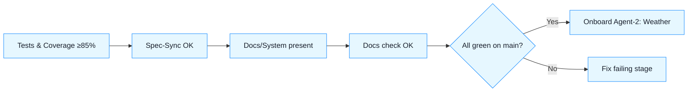

**Short answer:** Almost ready to onboard a second agent.
 From the zip you shared (`forecastingrepo_phase1_ready_20251102_202054.zip`) I verified tests/spec‑sync are in place and passing locally, but **this archive does not include** the `docs/System/*` set or the `docs_check.py` step you described. Fix that (or re‑zip the correct workspace) and you’re green.

------

## What I verified in the ZIP (facts)

- ✅ **Spec/Tests:**
  - `.tools/spec_sync.py` present; `spec_registry/spec_index.yml` maps: `CLI-001`, `DAILY-002`, `MONTHLY-003`, `REG-004`, `QA-005`, `WIN-006`.
  - Tests exist: `tests/e2e/test_cli_and_outputs.py`, `tests/unit/test_daily_semantics.py`, `tests/unit/test_monthly_semantics.py`, etc.
  - `requirements-dev.txt` includes **PyYAML>=6.0**.
- ✅ **CI workflow present:** `.github/workflows/ci.yml` runs pytest coverage and spec‑sync, enforces **≥85%** global coverage.
- ⚠️ **Missing in this zip:**
  - `docs/System/Onboarding.md`, `Repo_Layout.md`, `Testing.md`, `Spec_Sync.md`, `CI_CD.md`, `Release.md`.
  - `.tools/docs_check.py` and its CI step.
  - `README.md` (the ZIP has `README_BLUEPRINT.md` but not a top‑level README linking to `docs/System/Onboarding.md`).

> Conclusion: this looks like an earlier repo snapshot or a different workspace than the one you and the agent referenced.

------

## Make it “ready” (two quick options)

**Option A — Re‑zip the right workspace (preferred):**
 Zip the workspace where `docs/System/*`, `.tools/docs_check.py`, and the README changes actually exist, and push that.
 *Goal signal:* CI job shows **tests**, **spec‑sync**, **docs‑check**, and **coverage ≥85%** all green.

**Option B — Patch this repo to match your description:**

1. **Add `docs/System/` files** (the six pages).
2. **Add `.tools/docs_check.py`** and **append this to CI**:

```yaml
- name: Docs check
  run: python .tools/docs_check.py
```

1. **README.md**: add a “Start here” section linking to `docs/System/Onboarding.md`.
2. (Optional) Add a **critical‑module** gate (≥90% for `scripts/ingest_and_forecast.py`) as a separate step that parses `coverage.xml`.

------

## GO/NO‑GO

- **GO** to onboard a second agent **once the docs/System + docs check are in the repo and CI is green on `main`**.
- With the current ZIP, you’re at **4/6** readiness checks (tests, spec‑sync, coverage are OK; docs/System and docs‑check are missing; README link missing).

------

## Immediate orders for the existing agent (copy/paste)

1. **Ensure the repo pushed to origin contains:**
   - `docs/System/{Onboarding,Repo_Layout,Testing,Spec_Sync,CI_CD,Release}.md`
   - `.tools/docs_check.py`
   - `README.md` linking to `docs/System/Onboarding.md`
2. **Update CI** to run `python .tools/docs_check.py` after spec‑sync.
3. **Open PR**; verify CI is green; tag `v1-phase1-poc`.

**Definition of Done:** All checks green on `main`; spec_index generated; README points to Onboarding.

------

## After the gate is green — next parallel tracks

- **Agent‑2 (Weather, 2022–2024):** start with `weather_join.feature` (WEA‑001..003), `src/weather/adapter.py`, tiny fixtures, no model changes; feature‑flagged; tests + spec‑sync + docs updates.
- **Light visualization:** add `scripts/plot_reports.py` (simple PNGs) + “file exists” tests; later upgrade to a small HTML/CLI UI.
- **Branch policy:** protect `main` (require CI; no direct pushes); CODEOWNERS for `scripts/ingest_and_forecast.py`, `specs/**`, `.github/**`, `.tools/**`.

------

### Quick visual (what must be green)



If you want, I can assemble a minimal patch bundle (files + CI additions) that you can drop in to align this repo instantly, if yuo are sure yuo can do it you do it and add to zip and desibe i nyuor message