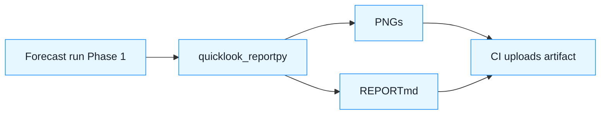

Great—let’s make **PR #1 = “Quicklook visualization & report”**.
 Scope: zero model changes, **fast visual sanity checks** on actuals (2024) vs forecasts (2025 windows), fully test‑gated.

------

## PR #1 — What we add

**New script**

- `scripts/quicklook_report.py`
  - **Args**:
    - `--actual-daily data/daily_waste_by_district.csv`
    - `--actual-monthly data/monthly_waste_by_district.csv`
    - `--forecast-daily deliveries/.../forecasts/daily_*.csv` (repeatable)
    - `--forecast-monthly deliveries/.../forecasts/monthly_*.csv` (repeatable)
    - `--outdir reports/quicklook_YYYYMMDD_HHMM`
    - `--top-k 5`
  - **Behavior** (headless, matplotlib Agg):
    - Build tidy frames for region + districts.
    - Generate **PNGs** (no interactive UI):
      1. `region_monthly_2024_vs_2025_forecast.png`
      2. `top5_districts_totals_2024_vs_2025_forecast.png`
      3. For each provided daily window: `region_daily_forecast_<window>.png`
    - Assemble `REPORT.md` that links the PNGs and shows 3 quick stats:
      - Δ% region total (2025 forecast vs 2024)
      - Month with largest YoY Δ
      - District with largest share change

**Minimal docs**

- `docs/System/Quicklook.md` (1–2 pages: how to run, what charts mean).

**Specs (new domain: VIZ)**

- `specs/bdd/features/viz_report.feature`
  - **VIZ‑001:** Report builds when inputs exist (PNG + REPORT.md produced).
  - **VIZ‑002:** PNGs have valid headers; filesize > 1KB.
  - **VIZ‑003:** `REPORT.md` contains links to generated PNGs.
  - **VIZ‑004:** When multiple daily windows are passed, one PNG per window.

**Unit brief**

- `specs/unit-md/unit_viz.md` (Spec‑IDs VIZ‑001..004; contract & limits).

**Tests**

- `tests/viz/test_quicklook_report.py`
  - Mark with `@pytest.mark.spec_id("VIZ-00X")`.
  - Use tiny fixtures to:
    - call `scripts/ingest_and_forecast.py forecast` on a **small window**,
    - then call `scripts/quicklook_report.py`,
    - assert PNG existence + PNG magic bytes + `REPORT.md` links.
- CI: upload `reports/quicklook_*` as artifact (optional).

**Dev deps**

- Add `matplotlib>=3.7` to `requirements-dev.txt`.
- In script: set backend `'Agg'` to avoid display requirements.

------

## Why this helps now

- Gives you **immediate eyeball checks** on seasonality/levels (region + top districts).
- No dependency on 2025 actuals; still useful to judge whether to send offer or iterate once more.
- Entirely behind tests; **doesn’t touch** forecast logic.

------

## Acceptance (DoD)

- `pytest` green; **coverage unchanged ≥85%** (viz tests count).

- `spec_sync.py` includes **VIZ‑001..004**.

- `docs_check.py` passes with `docs/System/Quicklook.md` referenced from **Onboarding.md**.

- Running:

  ```bash
  python scripts/ingest_and_forecast.py forecast \
    --train-until 2024-12-31 \
    --daily-window 2025-01-01:2025-03-31 \
    --monthly-window 2025-01:2025-12 \
    --scopes region,districts \
    --methods daily=weekday_mean,monthly=last3m_mean
  
  python scripts/quicklook_report.py \
    --actual-daily data/daily_waste_by_district.csv \
    --actual-monthly data/monthly_waste_by_district.csv \
    --forecast-daily deliveries/*/forecasts/daily_2025-01-01_to_2025-03-31.csv \
    --forecast-monthly deliveries/*/forecasts/monthly_2025-01_to_2025-12.csv \
    --outdir reports/quicklook_demo
  ```

  produces PNGs + `REPORT.md`.

------

## Guardrails / constraints

- **No seaborn.** Matplotlib only; set backend Agg.
- **No new runtime deps** for core forecast script.
- Charts are **static PNGs**; tests check existence + header, not pixels.
- **Region line** uses canonical region (sum of districts); this matches client CSVs.

------

## Future PRs (optional after this)

- Add a **single‑file HTML** (inline images) built from `REPORT.md` (no extra deps).
- Add a `--compare-2024-q4-backtest` mode to auto‑create a **visual backtest** (train cutoff at 2024‑09‑30; compare to Q4 actuals).

------

## Tiny visual of PR flow (for the PR description)



------

### Hand‑off to the agent (copy/paste)

**Task:** Implement PR #1 exactly as above (files, specs, tests, deps). Keep the PR focused on quicklook only. Ensure CI stays green and coverage ≥85%.