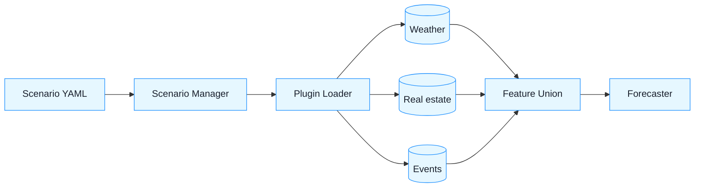

Absolutely—here’s a **clear, long‑term, plugin‑based plan** that lets us incrementally add (and remove) data sources beyond weather, **keep today’s outputs stable by default**, and evolve in **small, test‑gated PRs**. I’m giving you (1) a concise system vision, (2) drop‑in doc files you can paste into the repo for the coding agent, and (3) precise guardrails so we never break working forecasts.

------

## 0) Design goals (non‑negotiables)

- **Pluggable data sources** (weather now; real‑estate, events, demographics, tourism later).
- **Feature‑flag first:** *no* output changes unless a scenario/flag enables a source.
- **Golden stability:** a pinned **golden run** and **regression tests** ensure baseline outputs remain **bit‑for‑bit identical** unless we explicitly allow diffs.
- **Single pipeline switch:** scenario files (YAML) define which sources/features are on.
- **Determinism & provenance:** every run logs cutoff, flags, hashes, inputs.
- **Tiny PRs:** each PR adds one capability or fix, with tests/docs to match.

------

## 1) Architecture (at a glance)

```mermaid
flowchart TB
  A[Raw inputs\n2023–2024 waste\noptional sources] --> B[Adapters\n one per source]
  B --> C[Feature modules\nsource-specific transforms]
  C --> D[Scenario Manager\n(flags + config]
  D --> E[Forecaster\nbaseline now]
  E --> F[Deliveries\nforecasts, QA, metadata]
  D -.-> G[Evaluator\nbacktests, scoreboards]
  H[Registry.yml] ---> D
  classDef node fill:#e6f7ff,stroke:#1e90ff,color:#1a202c;
  class A,B,C,D,E,F,G,H node
```

------

## 2) Doc: **Vision/Design Document (VDD)**

> **Save as:** `docs/architecture/VDD.md`

```md
# Vision/Design (VDD)

## Goals
- Pluggable exogenous sources (weather, real-estate, events, demographics, tourism).
- Stable baseline: default scenario reproduces current Phase-1 outputs exactly.
- Scenario-driven runs: YAML toggles choose sources/features.
- Backtest-first evaluation; small, reliable increments.

## Non-Functional
- Deterministic runs; no network calls in pipeline.
- Reproducible: all inputs & outputs hashed; cutoff logged.
- CI gates: tests, spec-sync, docs-check, coverage; golden regression.

## Key Concepts
- **Data Source Plugin:** {adapter + features + join rules + QA}.
- **Scenario:** named configuration of enabled plugins & feature sets.
- **Golden Baseline:** a pinned run that must remain identical unless a scenario says otherwise.

## Interfaces (high-level)
- Adapter: `load(start, end) -> DataFrame[date, district, ...]`
- Features: `build(df, cutoff, params) -> FeatureFrame[date, district, f_*]`
- Join: `join(actuals, features, policy) -> actuals_ext` (no leakage past `cutoff`)
- Scenario Manager: reads YAML, builds pipeline graph, toggles sources.

## Rollout Strategy
1) Freeze current baseline (Scenario "baseline").
2) Introduce plugin framework with flags (no behavior change).
3) Add Weather plugin behind `--use-weather` or scenario toggle.
4) Add additional sources one-by-one (each PR tiny, fully tested).
```

------

## 3) Doc: **Plugin contract** (for any future source)

> **Save as:** `specs/source-plugins/PLUGIN_CONTRACT.md`

```md
# Plugin Contract

## Files & Manifest
- Directory: `src/plugins/<name>/`
- Manifest: `src/plugins/<name>/manifest.yml`
  - id: "<NAME>"
  - version: "0.1.0"
  - inputs: ["<file paths or loader keys>"]
  - provides: ["f_<feature1>", "f_<feature2>"]
  - granularity: "daily" | "monthly"
  - join_key: ["date","district"]
  - quality_checks: ["coverage","nonneg","range"]

## Python API
- `adapter.load(start, end, **cfg) -> pd.DataFrame[date, district, raw...]`
  - Must be deterministic; no external HTTP calls.
- `features.build(raw_df, cutoff, **params) -> pd.DataFrame[date, district, f_*]`
  - **No leakage**: derive using data `<= cutoff`.
- `join.attach(base_df, feat_df, policy) -> pd.DataFrame`
  - Policy must be explicit: (nearest, area-weighted, region fallback, zeros)
- `qa.validate(feat_df) -> dict`
  - Return counts, missingness, ranges; used in QA report.

## Tests Required
- Unit: adapter shape & dtypes; features leakage guard; join preserves row count.
- E2E: fixture -> adapter -> features -> join -> stable outputs.
- Golden: baseline scenario unchanged when plugin is DISABLED.

## CI Gates
- Coverage on `src/plugins/<name>` ≥ 90% lines.
- Spec-ID mapping via spec_sync.
```

------

## 4) Doc: **Scenario spec** + example configs

> **Save as:** `specs/scenarios/SCENARIO_SPEC.md`

```md
# Scenario Spec

## File
- Path: `scenarios/<scenario_id>.yml`
- Keys:
  - id: "baseline" | "weather_only" | "events_v1" | ...
  - flags:
      use_weather: false
      use_events: false
      use_re: false
  - sources:
      weather:
        plugin: "weather"
        params:
          temp_base_c: 18
          rolling: [7,14,28]
          join_policy: "nearest_or_region_avg"
      events:
        plugin: "events"
        params:
          intensity_col: "footfall_index"
  - windows:
      daily: ["2025-01-01:2025-03-31"]
      monthly: ["2025-01:2025-12"]

## CLI
- `--scenario-path scenarios/baseline.yml`
- Overrides allowed (last-wins):
  - `--flag use_weather=true`
  - `--param weather.temp_base_c=17`
```

**Example:** `scenarios/baseline.yml`

```yaml
id: baseline
flags:
  use_weather: false
  use_events: false
  use_re: false
sources: {}
windows:
  daily: ["2025-01-01:2025-03-31"]
  monthly: ["2025-01:2025-12"]
```

**Example:** `scenarios/weather_only.yml`

```yaml
id: weather_only
flags:
  use_weather: true
  use_events: false
  use_re: false
sources:
  weather:
    plugin: weather
    params:
      temp_base_c: 18
      rolling: [7,14,28]
      join_policy: nearest_or_region_avg
windows:
  daily: ["2025-01-01:2025-03-31"]
  monthly: ["2025-01:2025-12"]
```

------

## 5) Golden stability & regression strategy

- **Pin a golden run** from current Phase‑1 CLI (e.g., full‑year 2025 windows).
- Store **golden CSVs** under `tests/golden/phase1/…` (or store hashes in `tests/golden/golden.yml`).
- Add tests:
  - **Baseline scenario** must reproduce **exactly** the golden outputs.
  - **Any PR without scenario change** that alters outputs **fails CI**.
  - When an intentional change occurs, update golden only via a dedicated “golden bump” PR.

------

## 6) Interfaces for the agent to implement (thin, future‑proof)

> Light scaffolding; no model changes; purely structural. (You can give this to the agent.)

**A. Scenario Manager (module, small)**

- **File:** `src/scenarios/manager.py`
- **Functions:**
  - `load_scenario(path) -> Scenario` (pydantic or TypedDict)
  - `apply_overrides(scenario, flags:dict, params:dict) -> Scenario`
  - `is_enabled(scenario, source_id) -> bool`
- **Tests:** parsing, overrides, defaults.

**B. Plugin Loader**

- **File:** `src/plugins/loader.py`
- **Functions:**
  - `discover() -> list[PluginMeta]` (scan `src/plugins/*/manifest.yml`)
  - `get(id) -> Plugin` (returns module with adapter/features/join/qa)
- **Tests:** discovery on fixtures; error on missing.

**C. Forecast CLI wiring (non‑breaking)**

- Add optional args to existing CLI:
  - `--scenario-path`, `--flag key=value` (repeatable), `--param key=value` (repeatable).
- **Default behavior unchanged** if no scenario is passed.

**D. Weather as first plugin (no behavior change when disabled)**

- **Path:** `src/plugins/weather/` with `manifest.yml`, `adapter.py`, `features.py`, `join.py`, `qa.py`
- **Flag:** `use_weather` must be **false** by default.

------

## 7) Evaluation protocol (baked into docs, not code yet)

- **Rolling backtest** helper later: `scripts/backtest_eval.py` supports:
  - `--cutoffs 2024-03-31,2024-06-30,2024-09-30`
  - `--scenario-path scenarios/weather_only.yml` (or baseline)
- **Metrics:** WAPE (primary), SMAPE, MAE; at monthly region/district; daily optional.
- **Outputs:** `reports/backtest_<scenario>_<stamp>/{scoreboard_*.csv,SUMMARY.md}`.

------

## 8) Small UX touches (CLI now; UI later)

- **CLI** remains the main interface.
- **Quicklook report** script (`scripts/quicklook_report.py`) will **detect scenario name** and annotate charts.
- Later, a **single‑file HTML** report (no frameworks) can embed charts and key stats; still fully testable.

------

## 9) What to hand the coding agent **now** (task files)

### 9.1 Create the core docs (paste these)

- `docs/architecture/VDD.md` (above)
- `specs/source-plugins/PLUGIN_CONTRACT.md` (above)
- `specs/scenarios/SCENARIO_SPEC.md` + the two example YAMLs (baseline, weather_only)

### 9.2 Implement thin scaffolding (no behavior change)

1. **Scenario Manager** (`src/scenarios/manager.py`) + tests.
2. **Plugin Loader** (`src/plugins/loader.py`) + tests.
3. **CLI flags**: `--scenario-path`, `--flag`, `--param` (parsing only; no effect yet).
4. **Golden Regression**:
   - Create `tests/golden/golden.yml` with SHA256 of today’s **client CSVs** (full‑year windows).
   - Add test `test_golden_baseline.py`: run baseline (no scenario) → recompute hashes → must match.
   - Add CI job step: fail if golden mismatch (unless label `golden-update` present—optional).

**Definition of Done (for this PR):**

- All tests green; **no output changes** without scenario.
- `spec_sync.py` includes new Spec‑IDs for scenarios/plugins (e.g., `SCN-001..003`, `PLG-001..004`).
- Docs checker passes; new docs linked from `Onboarding.md`.

### 9.3 Weather plugin skeleton (still non‑invasive)

- Create `src/plugins/weather/manifest.yml` and empty stubs for `adapter.py`, `features.py`, `join.py`, `qa.py`.
- Add tests that **when `use_weather=false`**, the pipeline produces **identical outputs** to baseline (i.e., plugin discovery doesn’t alter behavior).
- Do **not** hook features into the forecaster yet; just prove discovery & flags work.

*(A later PR will actually compute weather features and add an option `--use-weather` / scenario toggle that changes outputs only when enabled.)*

------

## 10) Spec‑IDs to register now (for spec_sync)

Add these `.feature` shells (content minimal; we expand later):

- `specs/bdd/features/scenario_parsing.feature` → **SCN‑001**
- `specs/bdd/features/plugin_discovery.feature` → **PLG‑001**
- `specs/bdd/features/golden_regression.feature` → **GOLD‑001**
- `specs/bdd/features/scenario_no_change.feature` → **SCN‑002** (disabled sources leave outputs unchanged)

------

## 11) One more diagram (plugin flow)



------

### Bottom line

- This gives us a **stable baseline** (golden tests), **pluggable growth path** (sources as plugins), and **scenario control** to run “weather only”, “events+weather”, etc., without risk.
- You will see **tiny, incremental PRs**, each with **visible value** and **zero chance** of silently breaking outputs.

If you want, I can format these docs into ready‑to‑commit files (verbatim text above) and list the **exact tests/paths** for PR‑0 (scaffolding) and PR‑1 (weather skeleton).