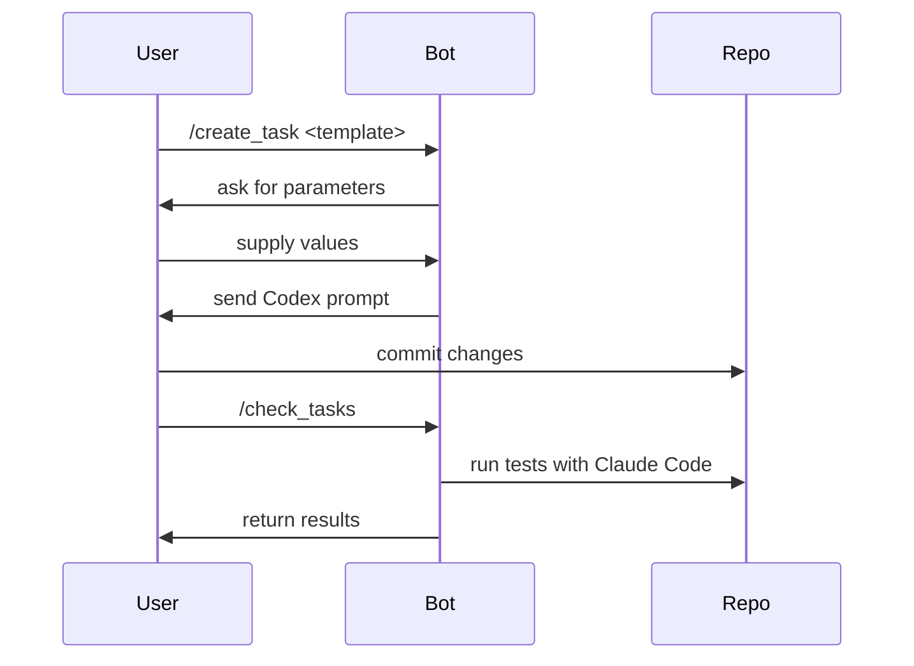

# Telegram Bot Quick Start

This guide explains how to interact with the TaskFlow Telegram bot. The bot allows you to create and manage tasks directly from your phone or desktop chat.

## Setup
1. Install the package and configure the bot:
   ```bash
   pip install .
   cp bot/.env.example bot/.env
   # edit bot/.env with your TELEGRAM_TOKEN and AUTHORIZED_USERS
   taskflow-bot
   ```

## Basic Commands
| Command | Description |
|---------|-------------|
| `/start` | Show introduction and list of available commands. |
| `/templates` | Display available task templates. |
| `/create_task <template>` | Create a task from the specified template. |
| `/check_tasks` | Process pending tasks with Claude Code. |
| `/template list` | List template names. |
| `/template get <name>` | Show template details. |
| `/template create` | Interactive template creation. |
| `/status` | Display recent tasks and their status. |

## Example Workflow
1. List templates:
   ```
   /templates
   ```
2. Create a new task using the `bug-fix` template:
   ```
   /create_task bug-fix
   ```
   Follow the prompts to provide parameter values. After the final prompt you will receive a Codex-ready message and Git instructions.
3. Once your implementation is committed and pushed, trigger Claude Code:
   ```
   /check_tasks
   ```

## Flow Diagram


Use `/status` at any time to see the latest tasks you created.
